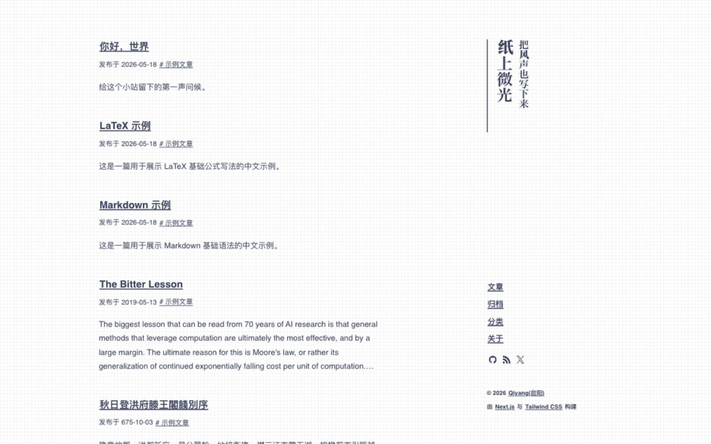

# Typography for Next.js

[简体中文](./README.zh-CN.md)

[](https://vercel.com/new/clone?repository-url=https%3A%2F%2Fgithub.com%2Fqiyangdev%2Ftypography)

A personal writing site built with Next.js and Tailwind CSS. It focuses on
typography, reading rhythm, and a quiet publishing workflow for technical notes,
reading notes, daily fragments, and anything else worth keeping.

This project is a Next.js + Tailwind CSS recreation based on
[sumimakito/hexo-theme-typography](https://github.com/sumimakito/hexo-theme-typography).
It keeps the theme's vertical title treatment, paper-like grid background,
restrained link interactions, and page transition feeling, while replacing the
content and rendering pipeline with local MDX and the Next.js App Router.

## Preview



## Features

- App Router pages for the post index, pagination, post details, archive,
  categories, about page, and Atom feed.
- Local MDX posts in `content/posts` with frontmatter, GFM, LaTeX, and fenced
  code blocks.
- Shiki-powered code highlighting with light and dark themes.
- LaTeX rendering through `remark-math` and `rehype-katex`.
- Dark mode through `next-themes`, defaulting to the system preference.
- Dynamic categories collected from post frontmatter, without a separate
  category map.
- Unicode slugs, including Chinese slugs, with encoded URL matching.
- Lightweight page transitions that mirror the original theme's feel.

## Run

```bash
bun run dev
```

Open [http://localhost:3000](http://localhost:3000).

## Content

Posts live in `content/posts` and use the `.mdx` extension. The about page is
written directly in `app/about/page.tsx` instead of being loaded from a Markdown
file.

Example frontmatter:

```mdx
---
title: Hello, World
pubDate: 2026-05-18
categories: ["Examples"]
description: "A first note for this site."
slug: hello-world
draft: false
pin: false
---
```

Fields:

- `title`: Post title.
- `pubDate`: Publish date.
- `modDate`: Optional update date. When present, post metadata displays the
  updated label.
- `categories`: Category list. Category pages are generated automatically.
- `description`: Optional summary for indexes and metadata. When missing, it is
  extracted from the post body.
- `slug`: Optional post path. When missing, it is generated from the title.
- `draft`: Optional. `draft: true` posts are hidden in production.
- `pin`: Optional. Pinned posts are shown earlier on the home page.
- `banner`: Optional image for Open Graph and Twitter metadata.

## Internationalization

Text dictionaries live in `lib/i18n.ts`. The current default locale is `zh-cn`;
change `defaultLocale` to switch the UI language.

Built-in locales: `zh-cn`, `en-us`, `zh-tw`, `ja-jp`, `it-it`.

## Routes

- `/`: Home post index.
- `/:page`: Paginated post index.
- `/posts/:slug`: Post detail page.
- `/archive`: Year archive.
- `/categories`: Category index.
- `/categories/:category`: Category post list.
- `/about`
- `/atom.xml`

## Structure

```text
app/                 App Router pages and route handlers
components/          Site title, navigation, pagination, and post metadata
content/posts/       MDX posts
lib/                 Content loading, post indexing, i18n, and dynamic MDX rendering
public/              Social icons and post placeholder assets
```

## Build

```bash
bun run build
```

## Lint

```bash
bun run lint
```
