这篇文章对应 Sebastian Raschka 的 _Build a Large Language Model (From Scratch)_ 第
3 章。前一章已经把原始文本变成 token ID、token embedding 和位置编码。接下来要进入
GPT-like LLM 的核心部件：**注意力机制**。

注意力机制要解决的问题很直接：一个 token 的表示不应该只包含它自己，还应该吸收上下
文里其它 token 的信息。第 3 章从最小 self-attention 开始，一步步加上可训练权重、因
果 mask、dropout，最后得到后续 GPT 模型会使用的 multi-head causal attention。

本章覆盖五件事：

- 为什么神经网络需要注意力机制来处理长序列。
- 如何从无可训练参数的 self-attention 推到带 `query`、`key`、`value` 的实现。
- GPT 这类从左到右生成文本的模型为什么必须屏蔽未来 token。
- dropout 如何作用在注意力权重上。
- 多个 causal attention head 如何组成 multi-head attention。

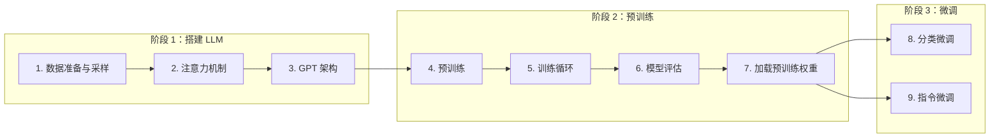

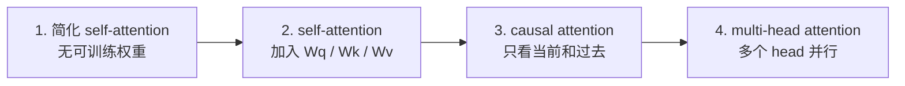

## 长序列问题

先看一个机器翻译问题。德语句子 `Kannst du mir helfen diesen Satz zu uebersetzen`
不能逐词翻译成英文。如果只按词序替换，就会得到类似 `Can you me help this sentence to
translate` 的错误句子。正确翻译必须参考前后文，重新安排词序和语法关系。

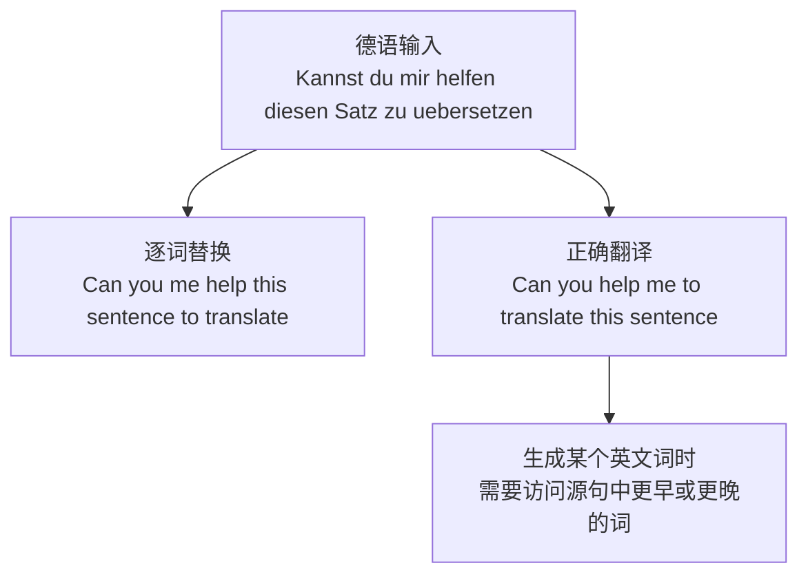

Transformer 出现之前，机器翻译常用 encoder-decoder RNN。encoder 逐步读入源语言序
列，把信息压缩进最终 hidden state；decoder 再拿这个 hidden state 逐 token 生成目标
语言。这个结构能工作，但有一个瓶颈：长句子里的全部信息都要塞进一个向量里，decoder
在生成时不能直接回看 encoder 早期的 hidden states。

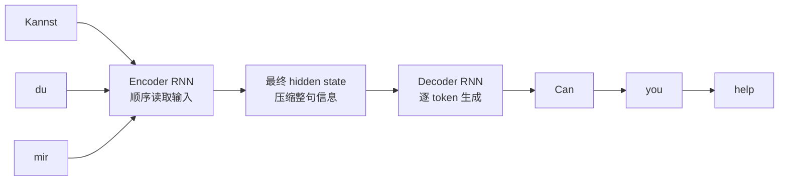

这就是注意力机制的动机。Bahdanau attention 让 decoder 在每一步生成时，都能选择性访
问 encoder 的不同位置，而不是只依赖最后一个 hidden state。之后，Transformer 进一步
证明：不一定需要 RNN，也能用 self-attention 建模序列内部的依赖关系。

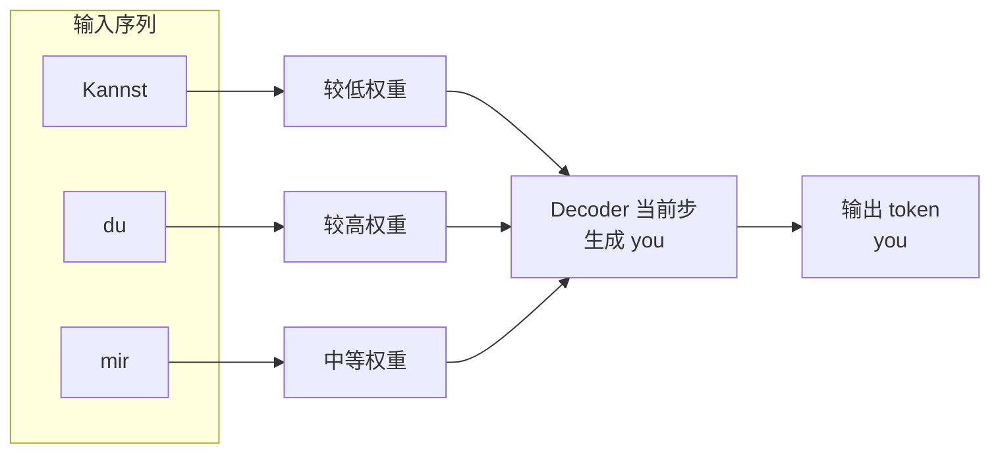

在 GPT-like 模型里，重点不是 encoder-decoder 之间的 attention，而是 **同一个输入序
列内部的 self-attention**。它让序列中的每个位置，都能根据其它位置的信息更新自己的表
示。

```mermaid title="图 6：self-attention 位于 GPT-like decoder-only Transformer 的核心。"
flowchart TB
    In["输入文本"]
    Prep["预处理\ntoken ID / embedding / 位置编码"]
    Attn["self-attention module"]
    Rest["后续 Transformer 组件\nLayerNorm / FFN / shortcut"]
    Out["输出文本"]

    In --> Prep --> Attn --> Rest --> Out
```

## Self-Attention 的目标

self-attention 里的 “self” 指的是：注意力权重来自同一个输入序列内部。每个 token 都
会和序列里的其它 token 建立关系，然后把这些关系汇入自己的上下文表示。

假设输入句子是：

```text
Your journey starts with one step
```

经过 embedding 后，句子变成一串向量：

```python
import torch

inputs = torch.tensor(
  [[0.43, 0.15, 0.89],  # Your
   [0.55, 0.87, 0.66],  # journey
   [0.57, 0.85, 0.64],  # starts
   [0.22, 0.58, 0.33],  # with
   [0.77, 0.25, 0.10],  # one
   [0.05, 0.80, 0.55]]  # step
)
```

self-attention 的目标是为每个输入向量 $x^{(i)}$ 计算一个上下文向量 $z^{(i)}$。上下文向
量可以理解成“增强后的 embedding”：它仍然对应当前位置，但已经融合了整个序列的信息。

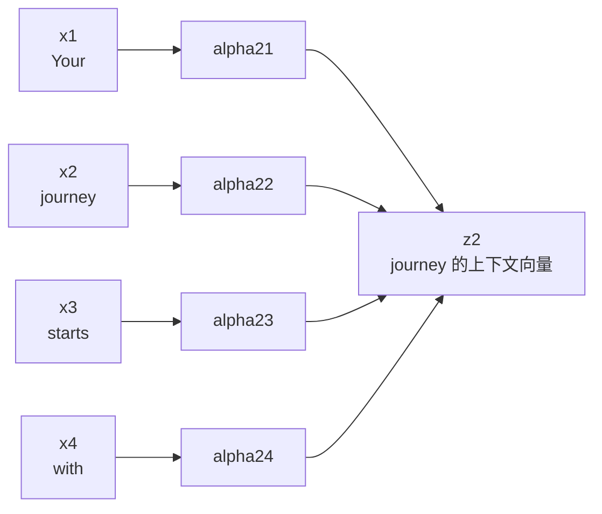

这里先聚焦第二个 token `journey`。我们希望计算 $z^{(2)}$，它既包含 `journey` 自己，也
包含 `Your`、`starts`、`with`、`one`、`step` 对它的贡献。

## 简化版 Self-Attention

简化版 self-attention 不引入可训练参数，只用点积、softmax 和加权求和。

第一步，把当前 token 当作 query。这里 query 就是 `inputs[1]`，也就是 `journey` 的
embedding。然后把它和所有输入向量做点积，得到注意力分数（attention scores）。

```python
query = inputs[1]
attn_scores_2 = torch.empty(inputs.shape[0])

for i, x_i in enumerate(inputs):
    attn_scores_2[i] = torch.dot(x_i, query)
```

点积可以看成相似度度量：两个向量方向越接近，点积越大。在 self-attention 里，点积越
大，说明当前 query 越应该关注对应输入。

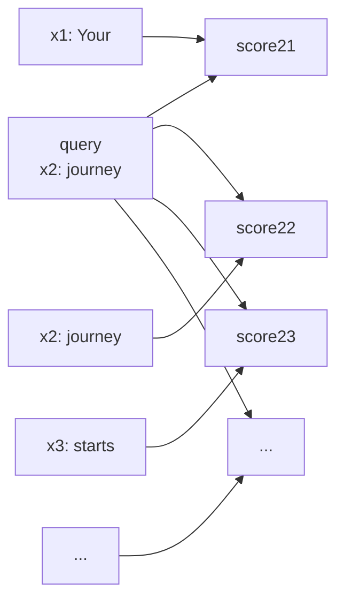

第二步，把注意力分数归一化成注意力权重（attention weights）。最常用的归一化方式是
softmax。它让所有权重为正，并且总和为 1。

```python
attn_weights_2 = torch.softmax(attn_scores_2, dim=0)
```

第三步，用注意力权重对所有输入向量做加权求和，得到上下文向量。

```python
context_vec_2 = torch.zeros(query.shape)

for i, x_i in enumerate(inputs):
    context_vec_2 += attn_weights_2[i] * x_i
```

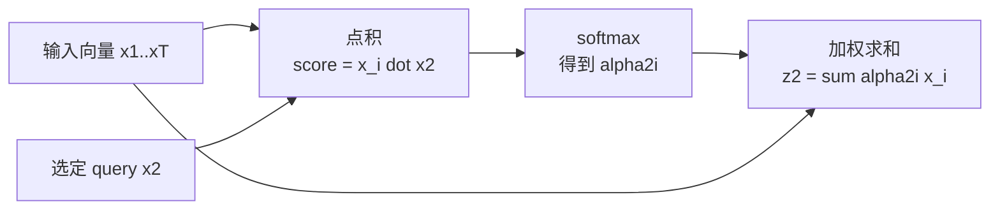

同样的计算可以推广到所有 token。最直接的写法是双层循环，计算每对输入之间的点积。
更高效的写法是矩阵乘法：

```python
attn_scores = inputs @ inputs.T
attn_weights = torch.softmax(attn_scores, dim=-1)
all_context_vecs = attn_weights @ inputs
```

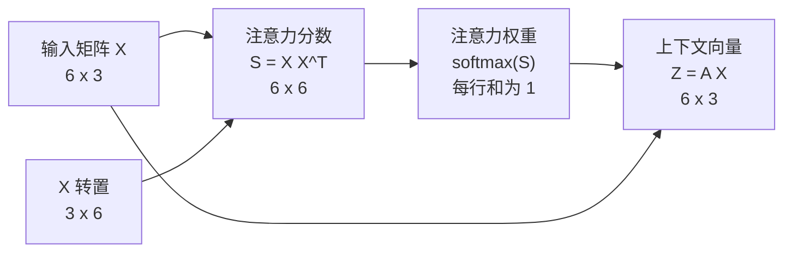

这完成了一个没有可训练权重的 self-attention。它能说明机制，但还不是 GPT 使用的版本。
真正的注意力层需要通过训练学习如何构造更有用的上下文向量。

## 加入可训练权重

Transformer、GPT 和大多数现代 LLM 使用的注意力通常叫 **scaled dot-product
attention（缩放点积注意力）**。它和刚才的简化版有同一个骨架，但多了三组可训练矩阵：

- $W_q$：把输入投影成 query。
- $W_k$：把输入投影成 key。
- $W_v$：把输入投影成 value。

query、key、value 这三个词来自信息检索和数据库语境。query 表示当前正在查询什么；
key 用来和 query 匹配；value 是匹配之后真正被汇入输出的内容。

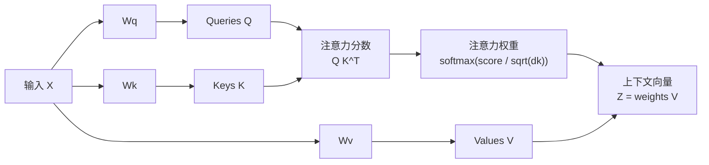

这里要区分两个 “weight”：

- weight parameters：模型里的可训练权重，例如 $W_q$、$W_k$、$W_v$。
- attention weights：softmax 之后动态算出来的权重，表示当前位置应该关注哪些 token。

第 3 章先用手写矩阵计算演示 $q^{(2)}$、$k^{(i)}$、$v^{(i)}$，然后把流程压成一个
PyTorch 类。核心公式是：

$$
\mathrm{Attention}(Q, K, V) =
\mathrm{softmax}\left(\frac{QK^T}{\sqrt{d_k}}\right)V
$$

除以 $\sqrt{d_k}$ 是为了训练稳定。如果 key/query 维度很大，点积值会变大，softmax 可能
变得接近阶跃函数，梯度变小，训练会变慢甚至停滞。缩放项让分数保持在更适合训练的范
围内。

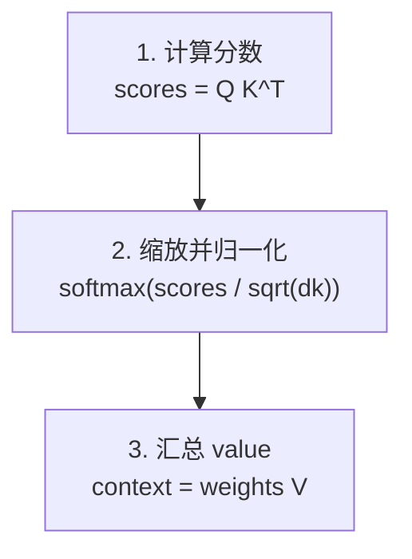

更接近实际工程的实现会用 `nn.Linear`，而不是手动创建
`nn.Parameter(torch.rand(...))`。`nn.Linear` 在 bias 关闭时就是矩阵乘法，并且自带更
合适的初始化方案。

```python
import torch
import torch.nn as nn

class SelfAttention_v2(nn.Module):
    def __init__(self, d_in, d_out, qkv_bias=False):
        super().__init__()
        self.W_query = nn.Linear(d_in, d_out, bias=qkv_bias)
        self.W_key = nn.Linear(d_in, d_out, bias=qkv_bias)
        self.W_value = nn.Linear(d_in, d_out, bias=qkv_bias)

    def forward(self, x):
        keys = self.W_key(x)
        queries = self.W_query(x)
        values = self.W_value(x)

        attn_scores = queries @ keys.T
        attn_weights = torch.softmax(
            attn_scores / keys.shape[-1]**0.5,
            dim=-1,
        )
        context_vec = attn_weights @ values
        return context_vec
```

这个版本还有一个限制：它会让每个 token 看见整个输入序列。对 GPT-like 自回归生成来
说，这会造成信息泄漏。

## 因果注意力

GPT 从左到右生成文本。预测当前位置的下一个 token 时，模型只能看到当前 token 以及它
之前的 token，不能提前看到未来 token。否则训练时模型会偷看答案，生成时又拿不到同样
的信息。

这就是 **causal attention（因果注意力）**，也叫 masked attention。它在注意力矩阵里把
主对角线右上方的位置屏蔽掉。

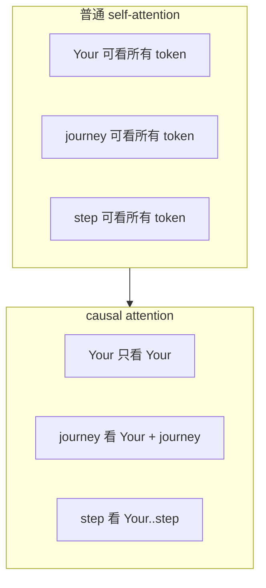

实现 mask 有两种方式。

第一种方式是：先 softmax，得到完整注意力权重；再把上三角置零；最后按行重新归一化。
这能解释概念，但实现上多了一步。

第二种方式更常见：在 softmax 之前，直接把未来位置的 attention scores 填成 `-inf`。
softmax 遇到 `-inf` 会把对应概率变成 0，因此不需要再手动归一化。

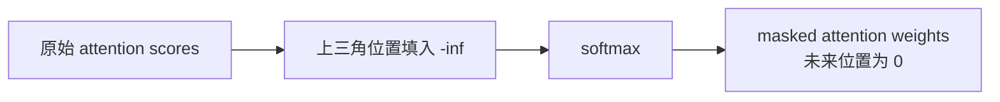

对应的 PyTorch 代码是：

```python
context_length = attn_scores.shape[0]
mask = torch.triu(torch.ones(context_length, context_length), diagonal=1)
masked = attn_scores.masked_fill(mask.bool(), -torch.inf)
attn_weights = torch.softmax(masked / keys.shape[-1]**0.5, dim=-1)
```

这个做法不会泄漏未来信息。虽然完整分数矩阵一开始已经算出来了，但被 mask 的位置在
softmax 后概率为 0，不会参与 value 的加权求和。

## 在注意力权重上使用 Dropout

训练 Transformer 时，dropout 常用于降低过拟合。在注意力模块里，dropout 可以应用在
注意力权重之后，也可以应用在注意力输出之后。第 3 章采用更常见的做法：对注意力权重
做 dropout。

如果 dropout rate 是 0.5，就会随机把约一半权重置零，并把剩余权重按 `1 / (1 - p)` 放
大。这样训练时平均影响力保持稳定，推理时再关闭 dropout。

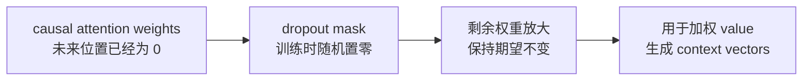

把 causal mask 和 dropout 合进类里，就得到后续多头注意力的基础版本：

```python
class CausalAttention(nn.Module):
    def __init__(self, d_in, d_out, context_length, dropout, qkv_bias=False):
        super().__init__()
        self.d_out = d_out
        self.W_query = nn.Linear(d_in, d_out, bias=qkv_bias)
        self.W_key = nn.Linear(d_in, d_out, bias=qkv_bias)
        self.W_value = nn.Linear(d_in, d_out, bias=qkv_bias)
        self.dropout = nn.Dropout(dropout)
        self.register_buffer(
            "mask",
            torch.triu(torch.ones(context_length, context_length), diagonal=1),
        )

    def forward(self, x):
        b, num_tokens, d_in = x.shape

        keys = self.W_key(x)
        queries = self.W_query(x)
        values = self.W_value(x)

        attn_scores = queries @ keys.transpose(1, 2)
        attn_scores.masked_fill_(
            self.mask.bool()[:num_tokens, :num_tokens],
            -torch.inf,
        )

        attn_weights = torch.softmax(
            attn_scores / keys.shape[-1]**0.5,
            dim=-1,
        )
        attn_weights = self.dropout(attn_weights)
        context_vec = attn_weights @ values
        return context_vec
```

这里的输入形状已经从单句矩阵扩展为 batch 张量：

```text
(batch_size, num_tokens, embedding_dim)
```

`register_buffer` 用来把 mask 注册成模型状态的一部分，但它不是可训练参数。这样模型移
动到 GPU 时，mask 也会跟着移动，避免 device mismatch。

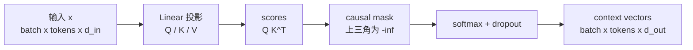

## 多头注意力

单个 causal attention 模块可以看作 single-head attention。多头注意力就是并行运行多
个 head，让不同 head 学到输入序列里的不同关系，然后把结果合并。

直观实现方式是堆叠多个 `CausalAttention`：

```python
class MultiHeadAttentionWrapper(nn.Module):
    def __init__(self, d_in, d_out, context_length, dropout, num_heads, qkv_bias=False):
        super().__init__()
        self.heads = nn.ModuleList(
            [
                CausalAttention(d_in, d_out, context_length, dropout, qkv_bias)
                for _ in range(num_heads)
            ]
        )

    def forward(self, x):
        return torch.cat([head(x) for head in self.heads], dim=-1)
```

如果 `num_heads=2`，每个 head 输出维度是 2，拼接后每个 token 的上下文向量维度就是
4。

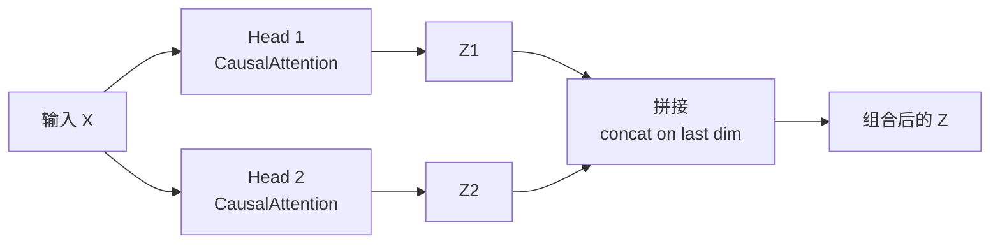

这个 wrapper 容易理解，但效率不是最好。因为每个 head 都单独做一次 Q/K/V 矩阵乘法。
更高效的做法是：用一个更大的线性层一次性得到所有 head 的 Q/K/V，然后用 `view` 和
`transpose` 把最后一维拆成 `num_heads` 和 `head_dim`。

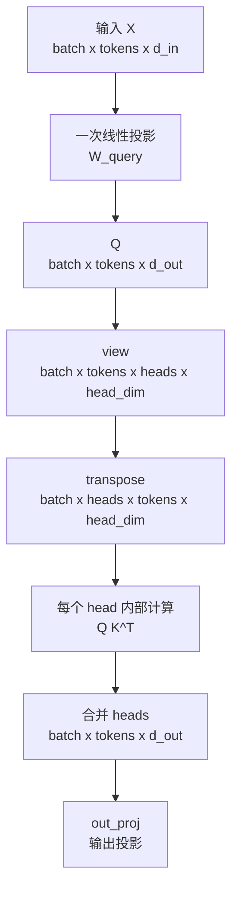

完整实现如下：

```python
class MultiHeadAttention(nn.Module):
    def __init__(
        self,
        d_in,
        d_out,
        context_length,
        dropout,
        num_heads,
        qkv_bias=False,
    ):
        super().__init__()
        assert d_out % num_heads == 0, "d_out must be divisible by num_heads"

        self.d_out = d_out
        self.num_heads = num_heads
        self.head_dim = d_out // num_heads

        self.W_query = nn.Linear(d_in, d_out, bias=qkv_bias)
        self.W_key = nn.Linear(d_in, d_out, bias=qkv_bias)
        self.W_value = nn.Linear(d_in, d_out, bias=qkv_bias)
        self.out_proj = nn.Linear(d_out, d_out)
        self.dropout = nn.Dropout(dropout)
        self.register_buffer(
            "mask",
            torch.triu(torch.ones(context_length, context_length), diagonal=1),
        )

    def forward(self, x):
        b, num_tokens, d_in = x.shape

        keys = self.W_key(x)
        queries = self.W_query(x)
        values = self.W_value(x)

        keys = keys.view(b, num_tokens, self.num_heads, self.head_dim)
        queries = queries.view(b, num_tokens, self.num_heads, self.head_dim)
        values = values.view(b, num_tokens, self.num_heads, self.head_dim)

        keys = keys.transpose(1, 2)
        queries = queries.transpose(1, 2)
        values = values.transpose(1, 2)

        attn_scores = queries @ keys.transpose(2, 3)
        mask_bool = self.mask.bool()[:num_tokens, :num_tokens]
        attn_scores.masked_fill_(mask_bool, -torch.inf)

        attn_weights = torch.softmax(
            attn_scores / keys.shape[-1]**0.5,
            dim=-1,
        )
        attn_weights = self.dropout(attn_weights)

        context_vec = (attn_weights @ values).transpose(1, 2)
        context_vec = context_vec.contiguous().view(b, num_tokens, self.d_out)
        context_vec = self.out_proj(context_vec)
        return context_vec
```

这段代码看起来复杂，核心只有两个变形：

- `view`：把 `d_out` 拆成 `num_heads x head_dim`。
- `transpose`：把张量变成 `(batch, heads, tokens, head_dim)`，方便每个 head 内部做批量
  矩阵乘法。

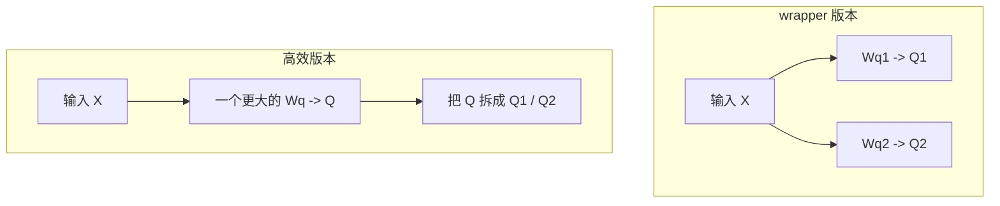

PyTorch 的矩阵乘法会自动处理四维张量的最后两个维度。也就是说，对于形状
`(batch, heads, tokens, head_dim)` 的张量，`queries @ keys.transpose(2, 3)` 会在每个
batch、每个 head 内部独立计算 `tokens x tokens` 的注意力分数矩阵。

最后的 `out_proj` 不是严格必需，但很多 LLM 架构都会在合并 heads 后再加一层输出投影。
它给模型一个机会，把多个 head 的输出重新混合。

## GPT-2 尺寸参照

书中为了便于展示，示例使用很小的 embedding 维度和 head 数。真实 GPT 模型要大得多。
最小 GPT-2 模型使用 12 个 attention heads，embedding/context 向量维度是 768，context
length 是 1024。GPT-2 最大模型有 25 个 heads，embedding/context 维度是 1600。

对应到本章最后的 `MultiHeadAttention`，最小 GPT-2 风格的初始化方向是：

```python
mha = MultiHeadAttention(
    d_in=768,
    d_out=768,
    context_length=1024,
    dropout=0.1,
    num_heads=12,
    qkv_bias=False,
)
```

这里 `d_out` 必须能被 `num_heads` 整除，因为每个 head 的维度是：

$$
\mathrm{head\_dim} = \frac{d_{out}}{\mathrm{num\_heads}}
$$

## 小结

注意力机制把输入 token 转成更丰富的上下文表示。简化 self-attention 用点积得到注意力
分数，用 softmax 得到注意力权重，再对输入向量加权求和。真正用于 LLM 的 self-attention
会加入可训练的 $W_q$、$W_k$、$W_v$，形成 query、key、value，并使用缩放点积注意力
稳定训练。

GPT-like 模型从左到右生成 token，所以需要 causal mask 屏蔽未来位置。训练时还可以在
注意力权重上应用 dropout，减少模型对某些连接的过度依赖。最后，多头注意力把多个
causal attention head 并行运行，让模型从不同表示子空间捕捉关系。高效实现不会真的创
建多个独立 attention 模块，而是一次性投影，再通过 `view`、`transpose` 和批量矩阵乘法
完成所有 head 的计算。

第 4 章会把这个 `MultiHeadAttention` 模块接进完整的 GPT 架构，并加入 LayerNorm、前
馈网络、shortcut connection 和文本生成逻辑。

## 参考

- Sebastian Raschka, _Build a Large Language Model (From Scratch)_, Chapter 3:
  Coding attention mechanisms.
- Bahdanau, Cho, and Bengio, _Neural Machine Translation by Jointly Learning to
  Align and Translate_, 2014.
- Vaswani et al., _Attention Is All You Need_, 2017.
