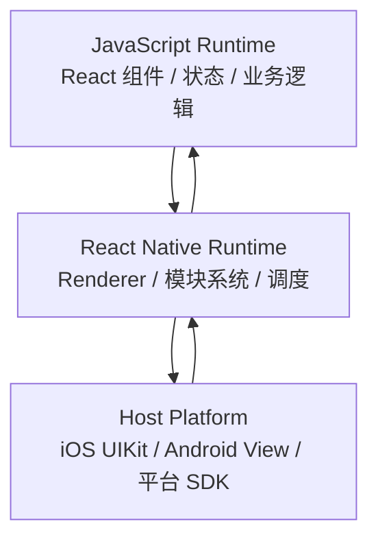
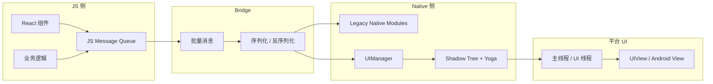
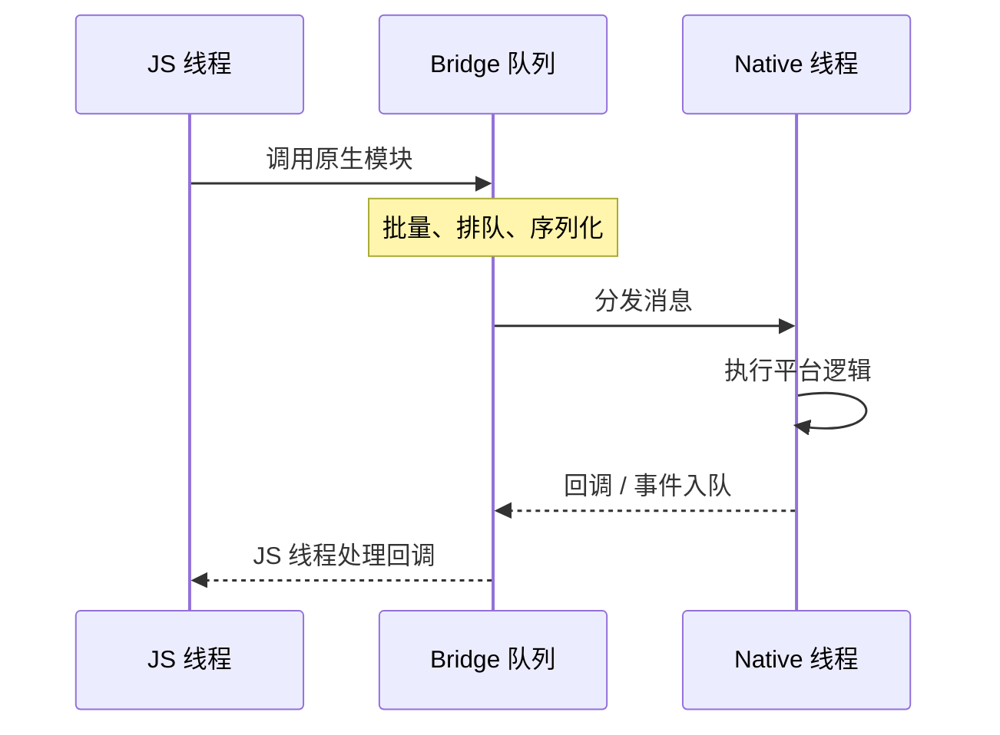
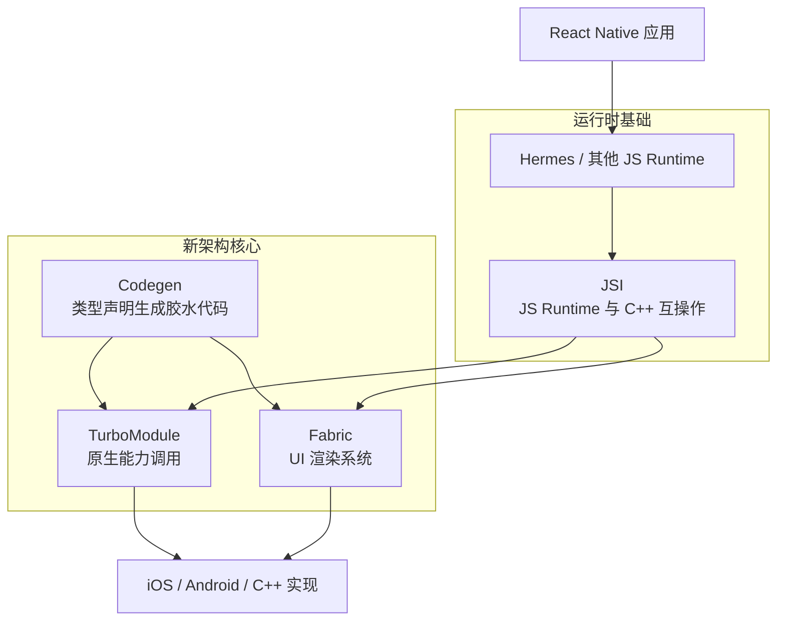
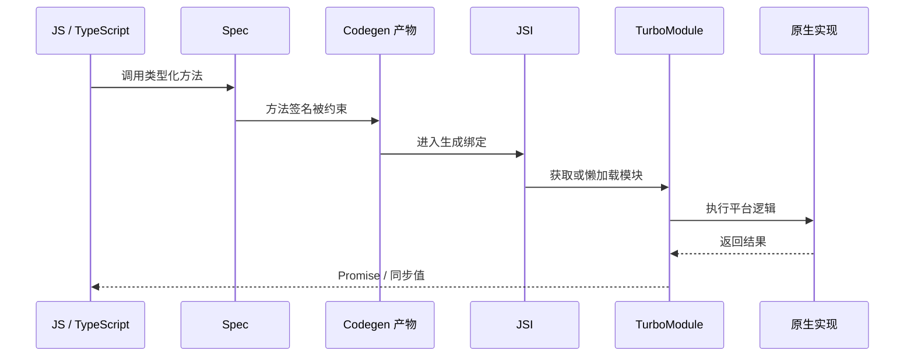
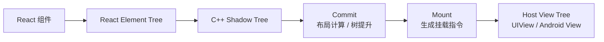
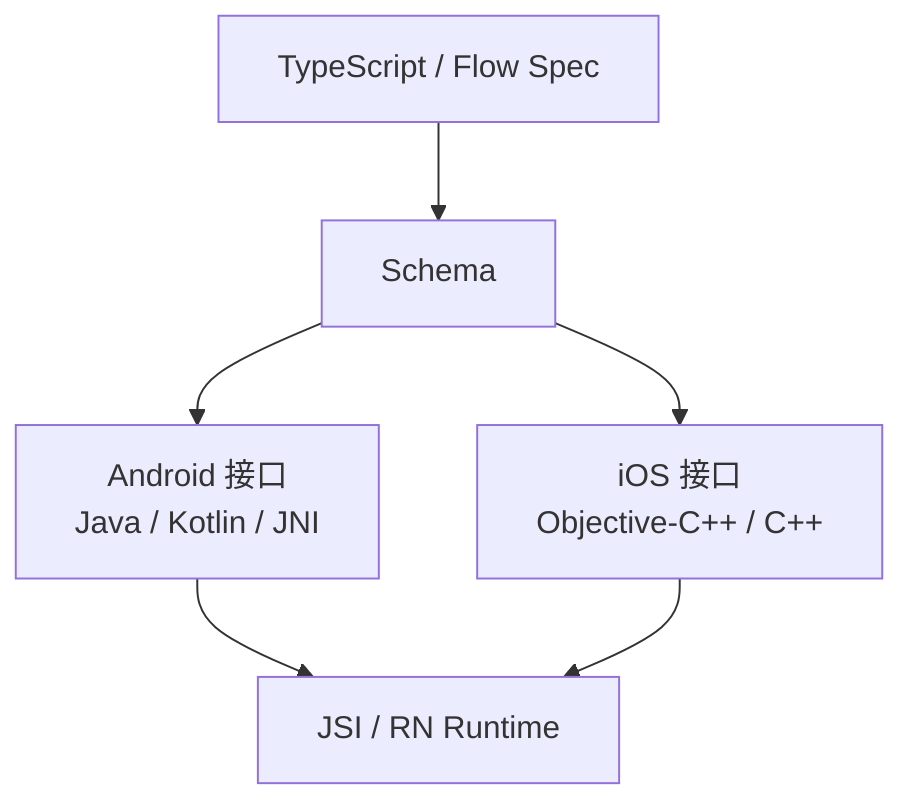
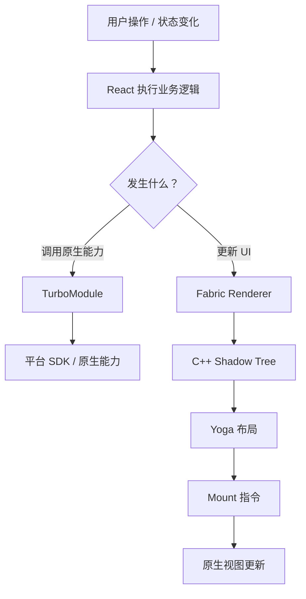

理解 React Native 架构时，最容易掉进两个误区：把 React Native 当成 WebView，或者把
新架构理解成“JS 被编译成原生代码”。这两个说法都不准确。

React Native 的本质是：**用 JavaScript 和 React 描述界面与状态，再由 React Native
把它们映射到 iOS / Android 的原生能力和原生视图上**。新架构不是改掉这个模型，而
是重写 JS 与 Native 之间的协作方式，让模块调用、UI 渲染、类型约束和 React 并发能
力更顺畅地工作在一起。

这篇文章按工程视角拆开看：

- 旧架构为什么以 Bridge 为中心。
- Bridge 的瓶颈具体来自哪里。
- JSI、TurboModule、Fabric、Codegen 各自解决什么问题。
- Hermes 和新架构是什么关系。
- 迁移新架构时应该检查什么，而不是只看“是否更快”。

## 先建立运行模型

React Native 应用可以粗略拆成三层：

1. **JavaScript Runtime**：执行 JS Bundle，运行 React 组件、状态更新、业务逻辑和
   第三方 JS 库。
2. **React Native Runtime / Renderer**：把 React Element Tree 转成 Shadow Tree，
   计算布局，生成对原生视图的创建、更新和删除指令。
3. **Host Platform**：iOS / Android 的真实平台层，负责原生模块、原生视图、主线程
   绘制、平台 SDK 和系统能力。



`View`、`Text`、`ScrollView` 这类核心组件最终都会落到平台视图体系里。React Native
不是在屏幕上画 HTML，也不是默认把所有 UI 绘制到一个 Canvas。它的优势来自 React
声明式编程模型和平台原生 UI 能力的组合；它的复杂度也来自这两套世界之间必须通信。

## 旧架构：Bridge 是中心通道

旧架构的关键词是 **Bridge**。JS 和 Native 之间不能直接共享对象引用，通信主要依赖
异步、批量、可序列化的消息。



这个模型并不意味着旧架构“必然慢”。大量业务 App 在旧架构下完全可以运行得很好。它
真正吃亏的地方，是 JS 和 Native 之间存在大量高频、低延迟、或者大对象数据传输时，
Bridge 的固定成本会被放大。

### 序列化不是唯一成本，但很典型

例如下面的调用在 JS 看起来只是一次普通函数调用：

```ts
import { NativeModules } from "react-native";

NativeModules.DeviceConfig.setConfig({
  brightness: 0.8,
  mode: "auto",
  options: {
    animated: true,
    duration: 300,
  },
});
```

在旧架构里，这类调用需要跨过 Bridge。参数要被整理成可以跨边界传输的数据，Native
侧再解析并分发到具体模块。这里的重点不是“永远会转成 JSON 字符串”，而是 **JS 对象
引用不能直接交给 Native 使用**，跨边界就会出现封装、拷贝、解析、排队和线程调度。

当调用频率低、数据量小，这些成本通常无感；当你每帧传相机帧、传手势轨迹、传音频采
样、传大数组或反复等待回调时，这些成本就会变成架构问题。

### 异步队列让返回值和时序变复杂

Bridge 通信更像投递消息，而不是普通的同步函数调用。



这会带来几个直接后果：

- 返回值通常不能像本地函数那样同步获得。
- 高频调用会堆积在队列里。
- 事件顺序、初始化时机、回调链路更容易被线程忙碌影响。
- UI 更新要经过 JS 计算、Bridge 投递、Native 处理、布局、主线程挂载等多个环节。

所以旧 Bridge 不适合把“每一帧都必须跨端往返”的事情放在 JS 和 Native 之间来回传。
动画、手势、相机、音视频、数据库 cursor、大块二进制数据，都应该尽量减少跨边界往
返，或者把热路径放在 Native / C++ / 专用运行时里。

## 新架构：把消息通道改成类型化接口

React Native 新架构不是单一功能，而是一组底层重构。它的目标不是“让所有代码自动更
快”，而是让 React Native 的核心边界从旧 Bridge 的消息队列，演进为更直接、更类型
化、更适合 React 并发渲染的接口体系。



从 React Native 0.76 开始，新架构已经在新项目中默认启用。对应用开发者来说，这意
味着新项目通常已经跑在 Fabric 和 TurboModule 体系下；对库作者来说，则意味着原生
模块和原生视图组件需要更认真地处理 Codegen、新架构兼容性和旧架构兼容策略。

## JSI：新架构的底座，不是业务 API

JSI 是 JavaScript Interface。它是一套 C++ API，让 JS Runtime 与 C++ / Native 之间
可以互相持有引用并调用方法。

旧 Bridge 的核心限制是“异步消息 + 可序列化数据”。JSI 允许 Native 侧通过 Host
Object 或 Host Function 把能力暴露给 JS Runtime，使 JS 可以持有某些 C++ 对象的引
用语义，而不是每次都把大块数据打包成 Bridge 消息。


这带来的变化很关键：跨边界调用可以更直接，某些数据结构可以避免旧 Bridge 的序列化
路径，高频场景也有机会放到 C++ / Native 热路径里处理。

但 JSI 不是“零成本传送门”。跨语言调用仍然有成本；同步调用仍然可能阻塞 JS Runtime；
对象生命周期、线程安全、内存所有权、异常边界也都需要更严格地处理。对多数应用开发
者来说，JSI 更像基础设施，而不是每天都要直接写的业务 API。

## TurboModule：重做原生模块系统

TurboModule 解决的是：**JS 如何调用原生能力**。

旧 Native Module 主要依赖 Bridge 暴露方法；TurboModule 则基于 JSI 和 Codegen，通
过类型声明生成 Native 侧接口和绑定代码。它带来的核心收益包括：

- 模块可以按需加载，减少启动阶段一次性注册和初始化压力。
- JS 与 Native 的方法签名由 Spec 约束，构建期更容易发现不一致。
- 跨边界调用路径更短，必要时可以提供同步接口。
- 更适合封装数据库、文件系统、加密、蓝牙、NFC、平台 SDK 等能力。

一个简化的 TurboModule Spec 大致长这样：

```ts
// specs/NativeSettings.ts
import type { TurboModule } from "react-native";
import { TurboModuleRegistry } from "react-native";

export interface Spec extends TurboModule {
  getString(key: string): string | null;
  setString(key: string, value: string): void;
  remove(key: string): void;
}

export default TurboModuleRegistry.getEnforcing<Spec>("NativeSettings");
```

这段代码的重点不在具体存储逻辑，而在接口方向：JS 侧先声明类型化 Spec，Codegen 再
根据 Spec 生成 iOS、Android 和 C++ 需要的胶水代码。Native 实现必须匹配这份接口。

同步方法要克制使用。读取内存里的小配置可以考虑同步；文件 IO、网络请求、数据库大
查询、等待主线程结果，都不应该因为 TurboModule 支持同步就塞进同步路径。



## Fabric：重做 UI 渲染系统

Fabric 解决的是：**React 组件如何变成原生 UI**。

它是新的 React Native Renderer，替代旧的 UIManager 渲染链路。Fabric 不负责原生能
力调用；那是 TurboModule 的职责。Fabric 负责把 React 的结果转成 C++ Shadow Tree，
再经过布局、提交和挂载，最终更新平台 Host View Tree。

官方把新渲染管线拆成三个阶段：

1. **Render**：React 执行业务逻辑，创建 React Element Tree；Renderer 同步创建 C++
   Shadow Tree。
2. **Commit**：新的 Shadow Tree 完成后成为下一棵要挂载的树，并触发布局计算。
3. **Mount**：带布局信息的 Shadow Tree 被转换为平台上的 Host View Tree。



Fabric 的价值不只是“少走 Bridge 所以更快”。它更重要的意义是让 React Native 的渲
染器能够更好地接住现代 React：

- 支持 React 并发渲染能力和更合理的优先级调度。
- 布局测量可以和 React 提交更紧密地协作，减少中间态闪烁。
- Shadow Tree 在 C++ 层更统一，跨平台渲染模型更一致。
- 自定义原生视图组件可以通过 Fabric Native Component 和 Codegen 约束接口。

对于应用开发者，Fabric 最直观的收益往往体现在复杂交互和布局测量场景，而不是每个
普通页面都立刻出现肉眼可见的性能跃迁。

## Codegen：把边界写成契约

Codegen 解决的是：**JS 类型声明和 Native 实现如何保持一致**。

在新架构里，TurboModule 和 Fabric Native Component 都可以先写 JS / TS / Flow 侧
Spec，然后由 Codegen 生成 Android、iOS 和 C++ 侧需要的接口、delegate、schema 和胶
水代码。



这件事看起来像构建工具细节，但它改变了库作者的工作方式：接口不再只靠手写桥接和运
行时约定维持，而是变成可以在构建期生成和校验的契约。

Codegen 特别适合约束两类边界：

- **TurboModule Spec**：描述原生模块暴露的方法、参数和返回值。
- **Fabric Native Component Spec**：描述自定义原生视图的 props、events 和 commands。

如果一个库仍依赖旧架构的手写桥接、旧 UIManager 命令或未迁移的 ViewManager 行为，
它在新架构下就可能出现构建失败、运行时找不到模块、事件不触发或命令调用异常。

## Hermes：重要，但不是新架构本身

Hermes 是 JavaScript 引擎，负责执行 JS Bundle，并提供 JS Runtime。它针对 React
Native 的启动、内存和包体积做了优化，现在也是 React Native 生态里的默认主流选择。

但概念上要分清：

| 名称        | 解决的问题                        |
| ----------- | --------------------------------- |
| Hermes      | 执行 JavaScript                   |
| JSI         | JS Runtime 与 C++ / Native 互操作 |
| TurboModule | JS 调用原生能力                   |
| Fabric      | React 组件渲染到原生 UI           |
| Codegen     | 从类型声明生成跨端接口代码        |

Hermes 经常和新架构一起出现，是因为它和 JSI、新渲染器、新模块系统配合得很好。但
“使用 Hermes”不等于“已经理解新架构”；反过来，只要某个 JS Runtime 支持 JSI，新架
构的概念也不必绑定在 Hermes 这个名字上。

## 一条完整链路

把前面的概念串起来，一个 React Native 应用大致会有两条主要路径：

- 调用平台能力：React / JS 业务逻辑通过 TurboModule 调到 Native。
- 更新 UI：React 产生新的组件树，Fabric 渲染并挂载原生视图。



这个图也说明了一个重要判断：如果你的性能瓶颈在 UI 渲染链路，优先看 Fabric、列表、
重渲染、布局和主线程；如果瓶颈在平台能力调用，优先看 TurboModule、JSI、调用频率
和数据形状。不要把所有问题都归因于“Bridge”或“新架构”。

## 旧架构与新架构对比

| 维度             | 旧架构                       | 新架构                             |
| ---------------- | ---------------------------- | ---------------------------------- |
| JS / Native 通信 | Bridge 异步批量消息          | JSI 互操作                         |
| 原生模块         | Legacy Native Module         | TurboModule                        |
| UI 渲染          | UIManager                    | Fabric Renderer                    |
| 接口约束         | 更多依赖手写桥接和运行时约定 | Codegen 生成类型化接口             |
| 模块初始化       | 更容易集中注册和初始化       | 支持按需加载                       |
| 同步能力         | 非主流，受 Bridge 模型限制   | 可支持，但要谨慎使用               |
| React 并发能力   | 支持受旧渲染器限制           | 更贴近现代 React Renderer          |
| 典型风险         | 高频通信成本、异步时序复杂   | 依赖兼容、Codegen 配置、原生库迁移 |

## 新架构会自动让应用变快吗？

不一定。

如果应用瓶颈来自 Bridge 高频通信、大数据跨端传输、原生模块初始化、同步布局测量或
旧 UIManager 链路，新架构通常更有价值。尤其是相机、音视频、动画、地图、数据库、
复杂原生 SDK、自定义原生视图组件这类场景，收益更容易体现出来。

但如果瓶颈来自下面这些地方，新架构不会自动替你解决：

- JS 线程上有大量同步计算。
- React 组件重复渲染，状态粒度过粗。
- 长列表没有做好虚拟化、分页和图片尺寸控制。
- 图片解码、视频渲染、地图 SDK 或广告 SDK 阻塞主线程。
- 网络请求、缓存策略、数据库查询本身设计不合理。
- 动画仍然把每一帧状态都拉回 JS。

新架构减少的是旧边界的系统性开销，并给更高级的渲染和互操作能力铺路。它不是性能优
化的替代品。

## 迁移时优先检查什么？

如果你维护的是业务 App，迁移前优先看这几类问题：

1. 当前 React Native / Expo SDK 版本是否已经默认启用新架构。
2. 依赖库是否明确支持新架构，尤其是含 Native Module、ViewManager、手势、动画、相
   机、地图、音视频、蓝牙、数据库的库。
3. 自己写的原生模块是否需要迁移为 TurboModule，是否要保留旧架构兼容层。
4. 自己写的原生视图组件是否需要迁移为 Fabric Native Component。
5. 是否依赖旧 Bridge 的初始化顺序、事件顺序、回调时机或 UIManager 命令。
6. Android 的 `newArchEnabled`、iOS 的 Pod 配置和 Codegen 输出是否进入 CI 校验。
7. 是否有足够的真机回归，覆盖冷启动、导航、登录、支付、推送、相机、地图、深链等
   原生链路。

如果你维护的是开源库，还要额外考虑：

- 是否发布清楚的 RN 版本兼容矩阵。
- 是否同时支持旧架构和新架构。
- 是否把 Codegen 产物、Podspec、Gradle 配置和 autolinking 路径都验证过。
- 是否为 Fabric commands、events、props 写了最小可运行示例。

## 常见误区

### 新架构是不是移除了所有 Bridge？

不是所有“桥接”概念都消失了。准确说，新架构移除了旧的异步 Bridge 作为核心通信机
制，改用 JSI、TurboModule、Fabric 和 Codegen 组成的新边界。生态里仍可能存在旧架
构兼容路径、旧模块或第三方库自己的桥接层。

### JSI 是不是越直接越好？

不是。JSI 让直接互操作成为可能，但越靠近底层，越要处理线程、生命周期、内存和异常
边界。业务代码不要因为“JSI 更快”就绕开成熟库和 RN 官方抽象。

### TurboModule 是否应该全部写同步方法？

不应该。同步调用只适合极小、确定、不会等待外部资源的场景。大多数 IO、网络、数据
库和平台 SDK 调用仍然应该保持异步，避免阻塞 JS Runtime。

### Fabric 和 TurboModule 有什么区别？

Fabric 管 UI 渲染，TurboModule 管原生能力调用。一个解决“组件如何变成原生视图”，
一个解决“JS 如何调用平台能力”。两者都依赖新架构底座，也都可以受益于 Codegen，但
职责不同。

### Expo UI 是否代表 React Native 组件都由 SwiftUI / Compose 实现？

不是。Expo UI 是 Expo 提供的一组原生 UI 能力，让你在 React 中使用 SwiftUI /
Jetpack Compose 组件。React Native 核心组件仍然有自己的跨平台 Host Component 体
系，不能把 Expo UI 的实现方式泛化为所有 RN 组件的实现方式。

## 小结

旧架构的核心是 Bridge：JS 和 Native 通过异步、批量、可序列化消息通信。这个模型在
普通业务场景下可用，但在高频、大数据、低延迟、复杂 UI 渲染和同步测量场景里会暴露
结构性成本。

新架构的核心不是某一个库，而是一组边界重构：

- **JSI** 让 JS Runtime 与 C++ / Native 直接互操作。
- **TurboModule** 让原生模块类型化、按需加载，并减少旧 Bridge 成本。
- **Fabric** 让 React Native 渲染器更贴近现代 React 和跨平台 C++ Shadow Tree。
- **Codegen** 把 JS 与 Native 的接口变成构建期契约。
- **Hermes** 负责执行 JS，重要但不是新架构本身。

真正理解新架构，不是记住名词，而是能判断一段问题发生在哪条链路：JS 计算、模块调
用、渲染管线、布局测量、主线程、第三方 SDK，还是依赖兼容。只有定位准了，新架构才
会从“概念升级”变成实际工程收益。

## 参考

- [React Native: About the New Architecture](https://reactnative.dev/architecture/landing-page)
- [React Native: Render, Commit, and Mount](https://reactnative.dev/architecture/render-pipeline)
- [React Native: Native Modules](https://reactnative.dev/docs/turbo-native-modules-introduction)
- [React Native: Fabric Native Components](https://reactnative.dev/docs/fabric-native-components-introduction)
- [React Native: Using Codegen](https://reactnative.dev/docs/the-new-architecture/using-codegen)
- [React Native: Using Hermes](https://reactnative.dev/docs/hermes)
- [Expo UI](https://docs.expo.dev/versions/latest/sdk/ui/)
