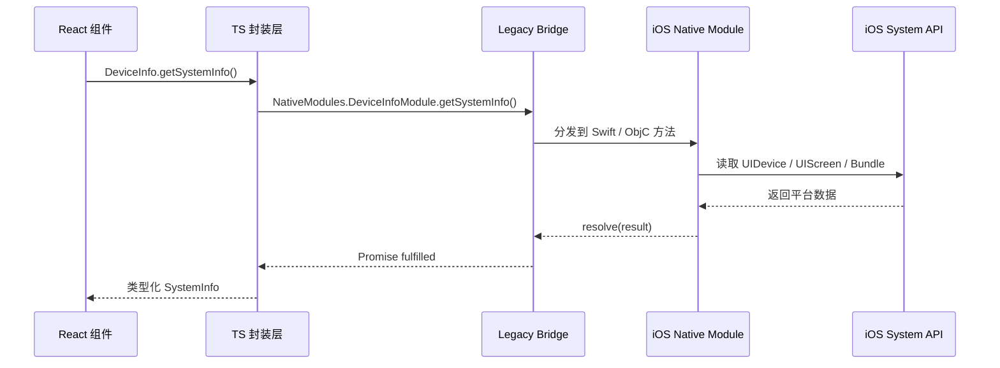
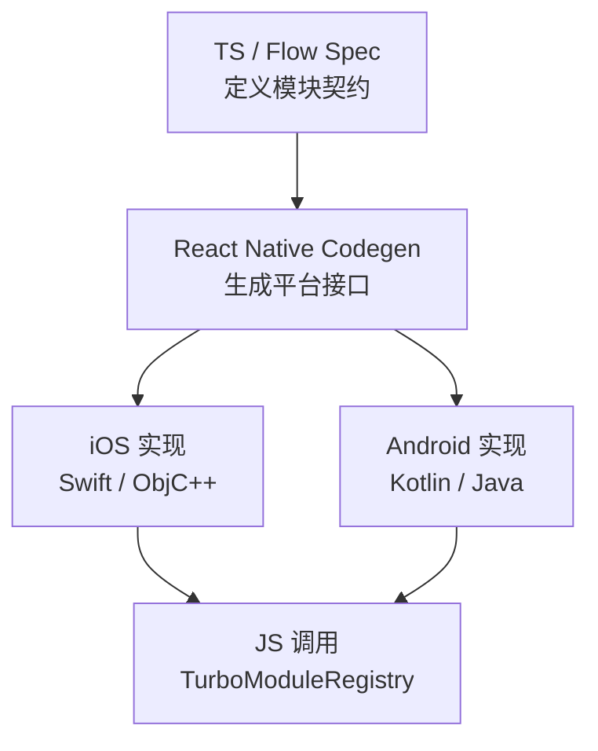

React Native 的原生桥接不是“在 JS 里调用一段 Swift / Kotlin 代码”这么简单。真正难
的是边界设计：哪些能力应该留在 JS，哪些必须下沉到 Native，跨边界的数据应该长什
么样，错误怎么表达，事件生命周期怎么收口，以及未来迁移到 TurboModule 时会不会被
今天的接口拖住。

这篇文章用一个 iOS 侧 `DeviceInfoModule` 做例子，重点放在工程上真正会踩坑的部分：

- 什么时候需要 Native Module。
- Promise、Callback、EventEmitter 分别适合什么场景。
- 如何用 Swift 暴露一个 Legacy Native Module。
- JS 侧为什么要再包一层类型化 API。
- 旧 Bridge 的限制在哪里，以及如何为 TurboModule 迁移预留接口。

示例以 iOS / Swift 为主。Android 侧的注册方式不同，但模块边界、参数设计、事件模型
和新架构迁移原则是一致的。

## 先判断是不是该写 Native Module

Native Module 的职责是把平台能力包装成 JS 可以调用的 API。常见场景包括蓝牙、相
机、推送、文件系统、传感器、支付 SDK、IoT SDK、音视频处理、后台任务和系统设置。

但不要一遇到平台差异就写桥接。一个更稳妥的判断顺序是：

| 问题                                            | 倾向                                          |
| ----------------------------------------------- | --------------------------------------------- |
| React Native 或成熟社区库已经覆盖，且性能可接受 | 直接使用现有能力                              |
| 只是 UI 组合、格式化、状态编排                  | 留在 JS                                       |
| 必须访问系统 API、厂商 SDK、硬件能力或权限回调  | 写 Native Module                              |
| 高频、低延迟、大数据量通信                      | 优先把热路径放在 Native / C++，减少跨边界往返 |
| 需要暴露原生视图                                | 写 Native Component，而不是 Native Module     |

Native Module 更像“平台服务接口”，不应该变成业务逻辑垃圾桶。它暴露给 JS 的 API
越小、越稳定，后续维护和迁移成本越低。

## Bridge 调用链路

旧架构里，JS 和 Native 之间通过 Bridge 通信。调用不是普通的本地函数调用，而是经
过队列、序列化、线程调度和回调分发。



这个模型适合低频、结果型调用，例如获取 App 版本、读取设备信息、触发一次授权请
求。它不适合把相机帧、音频采样、手势轨迹这类高频数据一帧一帧扔过 Bridge。

## 先设计 JS API

我习惯先从 JS 侧接口开始设计，因为这才是业务代码真正依赖的契约。Native 只是这个
契约的实现细节。

这个 Demo 暴露两个能力：

1. `getSystemInfo()`：一次性读取系统信息，用 Promise。
2. `subscribeBatteryLevel()`：持续监听电量变化，用事件订阅。

```ts
export interface SystemInfo {
  appVersion: string;
  buildNumber: string;
  deviceName: string;
  systemName: string;
  systemVersion: string;
  screenScale: number;
}

export interface BatteryLevelEvent {
  level: number;
  state: "unknown" | "unplugged" | "charging" | "full";
}

export interface DeviceInfoModule {
  getSystemInfo(): Promise<SystemInfo>;
  subscribeBatteryLevel(listener: (event: BatteryLevelEvent) => void): {
    remove(): void;
  };
}
```

这里有几个刻意的选择：

- JS 业务代码不直接碰 `NativeModules`。
- 返回值只包含可序列化数据，不把原生对象引用泄漏给 JS。
- 事件订阅返回 `remove()`，调用方必须能明确释放资源。
- 错误和不可用状态在封装层统一处理，而不是散落在页面里。

## JS 封装层

`NativeModules` 是桥接入口，但不应该在业务页面里到处直接使用。建议放在单独文件
里，把平台差异、类型断言、链接错误和事件生命周期都收住。

```ts
// src/native/DeviceInfo.ts
import { NativeEventEmitter, NativeModules, Platform } from "react-native";

export interface SystemInfo {
  appVersion: string;
  buildNumber: string;
  deviceName: string;
  systemName: string;
  systemVersion: string;
  screenScale: number;
}

export interface BatteryLevelEvent {
  level: number;
  state: "unknown" | "unplugged" | "charging" | "full";
}

interface NativeDeviceInfoModule {
  getSystemInfo(): Promise<SystemInfo>;
  startBatteryLevelUpdates(): void;
  stopBatteryLevelUpdates(): void;
  addListener(eventName: string): void;
  removeListeners(count: number): void;
}

const EVENT_NAME = "DeviceInfo:batteryLevelDidChange";
const NativeDeviceInfo = NativeModules.DeviceInfoModule as
  | NativeDeviceInfoModule
  | undefined;

function getNativeModule(): NativeDeviceInfoModule {
  if (!NativeDeviceInfo) {
    throw new Error(
      `DeviceInfoModule is not linked on ${Platform.OS}. Rebuild the native app after adding native code.`,
    );
  }

  return NativeDeviceInfo;
}

export const DeviceInfo = {
  getSystemInfo() {
    return getNativeModule().getSystemInfo();
  },

  subscribeBatteryLevel(listener: (event: BatteryLevelEvent) => void) {
    const nativeModule = getNativeModule();
    const emitter = new NativeEventEmitter(nativeModule);

    const subscription = emitter.addListener(EVENT_NAME, listener);
    nativeModule.startBatteryLevelUpdates();

    return {
      remove() {
        subscription.remove();
        nativeModule.stopBatteryLevelUpdates();
      },
    };
  },
};
```

这层封装还有一个长期价值：以后迁移到 TurboModule 时，页面和业务逻辑可以继续使用
`DeviceInfo.getSystemInfo()`，只需要替换封装层内部的模块获取方式。

## Swift 实现 Native Module

iOS 侧用 Swift 写真实逻辑，用一个 Objective-C bridge 文件把方法导出给 React
Native。下面的实现继承 `RCTEventEmitter`，因为它既要提供 Promise 方法，也要主动向
JS 发送电量事件。

```swift
// ios/DeviceInfoModule.swift
import Foundation
import React
import UIKit

@objc(DeviceInfoModule)
final class DeviceInfoModule: RCTEventEmitter {
  private var isObservingBattery = false
  private var hasListeners = false

  override static func requiresMainQueueSetup() -> Bool {
    false
  }

  override func supportedEvents() -> [String]! {
    ["DeviceInfo:batteryLevelDidChange"]
  }

  override func startObserving() {
    hasListeners = true
  }

  override func stopObserving() {
    hasListeners = false
  }

  @objc(getSystemInfo:rejecter:)
  func getSystemInfo(
    _ resolve: @escaping RCTPromiseResolveBlock,
    rejecter reject: @escaping RCTPromiseRejectBlock
  ) {
    DispatchQueue.main.async {
      let bundle = Bundle.main
      let screen = UIScreen.main
      let device = UIDevice.current

      resolve([
        "appVersion": bundle.object(forInfoDictionaryKey: "CFBundleShortVersionString") as? String ?? "",
        "buildNumber": bundle.object(forInfoDictionaryKey: "CFBundleVersion") as? String ?? "",
        "deviceName": device.name,
        "systemName": device.systemName,
        "systemVersion": device.systemVersion,
        "screenScale": screen.scale,
      ])
    }
  }

  @objc
  func startBatteryLevelUpdates() {
    DispatchQueue.main.async {
      guard !self.isObservingBattery else { return }

      self.isObservingBattery = true
      UIDevice.current.isBatteryMonitoringEnabled = true

      NotificationCenter.default.addObserver(
        self,
        selector: #selector(self.batteryDidChange),
        name: UIDevice.batteryLevelDidChangeNotification,
        object: nil
      )

      NotificationCenter.default.addObserver(
        self,
        selector: #selector(self.batteryDidChange),
        name: UIDevice.batteryStateDidChangeNotification,
        object: nil
      )

      self.emitBatteryLevel()
    }
  }

  @objc
  func stopBatteryLevelUpdates() {
    DispatchQueue.main.async {
      guard self.isObservingBattery else { return }

      self.isObservingBattery = false
      NotificationCenter.default.removeObserver(self)
      UIDevice.current.isBatteryMonitoringEnabled = false
    }
  }

  override func invalidate() {
    DispatchQueue.main.async {
      NotificationCenter.default.removeObserver(self)
      UIDevice.current.isBatteryMonitoringEnabled = false
    }
    super.invalidate()
  }

  @objc
  private func batteryDidChange() {
    emitBatteryLevel()
  }

  private func emitBatteryLevel() {
    guard hasListeners else { return }

    let device = UIDevice.current

    sendEvent(
      withName: "DeviceInfo:batteryLevelDidChange",
      body: [
        "level": max(device.batteryLevel, 0),
        "state": batteryStateName(device.batteryState),
      ]
    )
  }

  private func batteryStateName(_ state: UIDevice.BatteryState) -> String {
    switch state {
    case .unplugged:
      return "unplugged"
    case .charging:
      return "charging"
    case .full:
      return "full"
    case .unknown:
      fallthrough
    @unknown default:
      return "unknown"
    }
  }
}
```

注意几点：

- 访问 `UIScreen` 和 `UIDevice` 时切到主线程，避免把 UIKit 相关访问散到任意队列。
- `startBatteryLevelUpdates()` 做幂等保护，避免重复注册通知。
- `stopBatteryLevelUpdates()` 和 `invalidate()` 都释放观察者。
- 事件名使用模块前缀，减少和其它模块冲突的概率。

## Objective-C 导出文件

Swift 方法不会自动出现在 JS 侧。Legacy Native Module 仍需要一个 Objective-C 文件
使用 `RCT_EXTERN_MODULE` 和 `RCT_EXTERN_METHOD` 声明导出面。

```objc
// ios/DeviceInfoModuleBridge.m
#import <React/RCTBridgeModule.h>
#import <React/RCTEventEmitter.h>

@interface RCT_EXTERN_MODULE(DeviceInfoModule, RCTEventEmitter)

RCT_EXTERN_METHOD(getSystemInfo:(RCTPromiseResolveBlock)resolve
                  rejecter:(RCTPromiseRejectBlock)reject)

RCT_EXTERN_METHOD(startBatteryLevelUpdates)
RCT_EXTERN_METHOD(stopBatteryLevelUpdates)

@end
```

添加或修改 Native 代码后，需要重新构建原生 App。Metro 热更新只能替换 JS bundle，
不会重新编译 iOS / Android 工程。

## 页面使用方式

页面只依赖 `src/native/DeviceInfo.ts` 暴露的稳定 API，不关心下面是 Bridge 还是
TurboModule。

```tsx
// src/App.tsx
import React from "react";
import { Button, SafeAreaView, Text, View } from "react-native";
import { DeviceInfo, type BatteryLevelEvent } from "./native/DeviceInfo";

export default function App() {
  const [systemInfo, setSystemInfo] = React.useState<string>("Not loaded");
  const [battery, setBattery] = React.useState<BatteryLevelEvent | null>(null);

  React.useEffect(() => {
    const subscription = DeviceInfo.subscribeBatteryLevel(setBattery);

    return () => {
      subscription.remove();
    };
  }, []);

  async function loadSystemInfo() {
    const info = await DeviceInfo.getSystemInfo();
    setSystemInfo(
      `${info.deviceName} · ${info.systemName} ${info.systemVersion}`,
    );
  }

  const batteryText = battery
    ? `${Math.round(battery.level * 100)}% · ${battery.state}`
    : "Unknown";

  return (
    <SafeAreaView>
      <View style={{ gap: 12, padding: 24 }}>
        <Text>{systemInfo}</Text>
        <Text>Battery: {batteryText}</Text>
        <Button title="Load system info" onPress={loadSystemInfo} />
      </View>
    </SafeAreaView>
  );
}
```

实际项目里还应该在 `loadSystemInfo()` 外层处理错误，例如模块未链接、权限拒绝、原
生 SDK 初始化失败等。

## Promise、Callback、EventEmitter 怎么选

桥接 API 的返回形态应该由业务语义决定，不要为了“简单”把所有东西都塞进 Callback。

| 方式         | 适合场景                                         | 建议                                 |
| ------------ | ------------------------------------------------ | ------------------------------------ |
| Promise      | 一次性异步结果，例如读取配置、请求授权、执行支付 | 默认优先选它                         |
| Callback     | 包装老 SDK 或代理回调，尤其是历史代码            | 控制调用次数，避免长期持有导致泄漏   |
| EventEmitter | 连接状态、传感器、下载进度、播放器状态等持续变化 | 必须设计订阅和取消订阅               |
| 同步方法     | 极少数必须同步返回的小数据                       | 谨慎使用，避免阻塞 JS 或破坏调试链路 |

工程上最容易出问题的是 EventEmitter：忘记取消订阅、重复启动原生监听、页面卸载后还
在发事件，都会导致难查的状态错乱和内存问题。

## Bridge 的限制不是“慢”这么简单

Legacy Bridge 的主要限制来自异步消息队列和跨边界数据转换。它不是不能用，而是不适
合高频、低延迟、大数据量的双向通信。


几个经验判断：

- 低频调用，例如“点击按钮后读取一次系统信息”，Bridge 成本通常不是瓶颈。
- 高频事件，例如每秒几十次传感器数据，需要节流、批处理或把计算放在 Native。
- 大对象，例如图片、音频、二进制块，不要直接来回传 JS 对象；优先传 URI、句柄或
  原生侧缓存 key。
- 动画和手势的热路径不要依赖 JS 与 Native 每帧往返。

## 面向 TurboModule 预留迁移空间

React Native 新架构下，原生能力会逐步走向 Turbo Native Module。官方当前文档的基
本路径是：先定义 TypeScript / Flow spec，再配置 Codegen，由 Codegen 生成原生接口
和胶水代码，最后实现平台代码并注册到运行时。



如果希望今天写的 Legacy Module 将来容易迁移，接口设计上可以先遵守这些约束：

- 方法参数和返回值尽量使用明确、可序列化、可类型化的数据结构。
- 避免依赖 `RCTConvert` 支持的复杂隐式转换。
- 不把 Callback 当作长期事件通道，持续状态用事件或明确的订阅模型。
- JS 业务层只依赖自己的封装文件，不直接依赖 `NativeModules`。
- 让 Native Module 只暴露平台能力，不承载大段业务流程。

这样迁移到 TurboModule 时，变化主要集中在 spec、Codegen 配置和 native 注册层，而
不是扩散到所有页面。

## 一个可执行的检查清单

写 Native Module 前，可以用这组问题过一遍：

1. 这个能力是否真的需要平台 API 或厂商 SDK？
2. JS 与 Native 之间传输的数据是否足够小、足够稳定？
3. 是否需要持续事件？如果需要，取消订阅在哪里发生？
4. 原生侧是否有资源生命周期，例如权限、通知观察者、连接、文件句柄？
5. 错误码是否能被 JS 稳定识别，而不是只返回一段本地化文案？
6. 页面是否只依赖封装层 API，而不是直接依赖 `NativeModules`？
7. 将来切到 TurboModule 时，现有 API 是否可以自然变成一个 typed spec？

桥接代码本身通常不长，真正决定质量的是边界。边界稳定、数据简单、生命周期清楚，
Native Module 才会成为 React Native 工程里的平台能力层，而不是后续迁移和排障的负
担。

参考文档：

- [React Native Legacy iOS Native Modules](https://reactnative.dev/docs/legacy/native-modules-ios)
- [React Native Turbo Native Modules](https://reactnative.dev/docs/turbo-native-modules-introduction)
