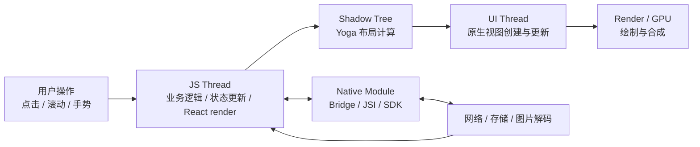
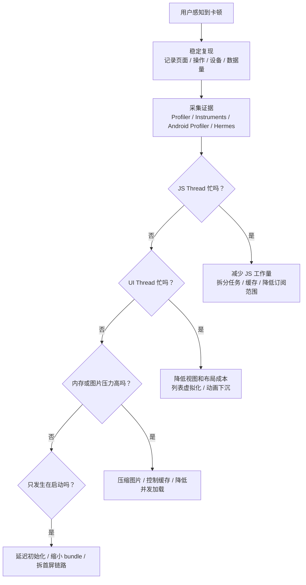
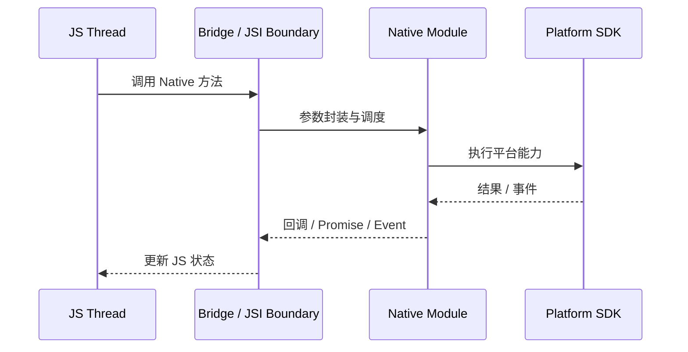
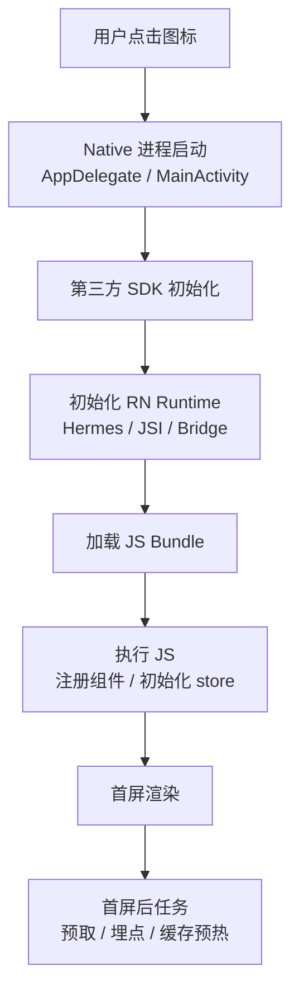

React Native 性能优化最常见的误区，是一上来就问“是不是该换新架构”“是不是该上
Reanimated”“是不是 FlatList 参数没调好”。这些问题都可能成立，但它们不是排查起
点。

更可靠的做法是先回答：**卡在哪里、为什么卡、用户在哪个动作里感知到卡**。React
Native 的性能问题通常不是单点问题，而是 JS 执行、React 重渲染、列表虚拟
化、Native通信、图片解码、启动链路和线程调度共同作用的结果。

这篇文章按工程排查顺序展开：

- 先建立 React Native 的性能模型。
- 再判断问题属于 JS、渲染、列表、通信、动画、图片还是启动。
- 每一类问题给出典型症状、常见原因和可落地的修正方式。
- 最后给出工具链和优化优先级，避免凭感觉改代码。

## 性能模型：先找到瓶颈线程

React Native 应用不是只有一个“主线程”。一个操作从用户触发到屏幕变化，通常会经过
JS、React reconciler、Shadow Tree、布局计算、Native UI 和平台渲染。任何一段过
慢，都会表现成卡顿。



如果 JS Thread 忙，点击响应、状态更新和 JS 驱动动画都会延迟。如果 UI Thread
忙，JS看起来不慢，但滚动、转场和原生绘制仍然会掉帧。如果图片解码和内存压力太大，
问题可能既不像 JS 卡顿，也不像 React 重渲染，而是表现为滚动抖动、闪白或被系统杀
进程。

所以优化前先做归因：



不要把所有卡顿都归因到 React Native。低端 Android 设备、大图、过深视图树、同步
JSON 解析、接口返回结构、第三方 SDK 初始化和原生页面嵌套，都可能是瓶颈来源。

## JS Thread 卡顿

JS Thread 承担业务逻辑、状态更新、React render、事件回调和很多第三方库逻辑。一旦
它被长任务占满，用户点击、输入、滚动回调、定时器和 Promise 回调都会排队。

常见原因包括：

- 一次性处理大量接口数据。
- 在 render 中做过滤、排序、分组和格式化。
- 同步解析大 JSON。
- 高频 `setState` 或 Redux action。
- selector 每次返回新对象，导致大范围重渲染。
- 复杂计算放在手势或滚动回调里。

### 把重计算移出 render

下面这种代码在数据量小时看不出问题，但列表一大，每次 render 都会重复排序和过滤。

```tsx
function DeviceScreen({ devices, keyword }: DeviceScreenProps) {
  const visibleDevices = devices
    .filter((device) => device.name.includes(keyword))
    .sort((left, right) => right.rssi - left.rssi);

  return <DeviceList devices={visibleDevices} />;
}
```

可以把它改成稳定的派生计算：

```tsx
import { useMemo } from "react";

function DeviceScreen({ devices, keyword }: DeviceScreenProps) {
  const visibleDevices = useMemo(() => {
    const normalizedKeyword = keyword.trim().toLowerCase();

    return devices
      .filter((device) => device.name.toLowerCase().includes(normalizedKeyword))
      .sort((left, right) => right.rssi - left.rssi);
  }, [devices, keyword]);

  return <DeviceList devices={visibleDevices} />;
}
```

如果数据来自 Redux，优先用 memoized selector，而不是在组件里反复构造新数组。

### 拆分长任务

同步处理大数组会阻塞 JS Thread。能分页就分页，能服务端处理就服务端处理，必须本地
处理时要分批。

```ts
type WorkItem = {
  id: string;
  payload: string;
};

export function processInChunks(
  items: WorkItem[],
  handleChunk: (chunk: WorkItem[]) => void,
  chunkSize = 100,
) {
  let cursor = 0;

  const run = () => {
    const chunk = items.slice(cursor, cursor + chunkSize);
    handleChunk(chunk);
    cursor += chunkSize;

    if (cursor < items.length) {
      setTimeout(run, 0);
    }
  };

  run();
}
```

这不是为了让总耗时变短，而是为了把连续阻塞切开，让事件循环有机会处理用户交互。对
更重的计算，应考虑放到后端、原生模块、JSI、Worklet 或专用线程方案里。

### 延迟非首屏任务

页面进入后不一定要立刻做完所有事。首屏展示之后再加载次要数据，往往比“初始化时一
次全做完”更接近用户体验目标。

```tsx
import { InteractionManager } from "react-native";

useEffect(() => {
  const task = InteractionManager.runAfterInteractions(() => {
    warmUpSearchIndex();
    prefetchSecondaryData();
  });

  return () => {
    task.cancel();
  };
}, []);
```

`InteractionManager` 适合延迟非关键任务，但不要把核心数据请求都塞进去。优化的目
标是缩短关键路径，而不是让功能不可预测地延后。

## React 重渲染优化

React 重渲染本身不是问题。问题是“不该更新的组件也更新了”，或者每次更新都携带昂贵
计算和复杂视图树。

常见触发点：

- 父组件 state 变化导致整棵子树 render。
- inline object、inline array、inline function 让 props 引用每次变化。
- Context 范围过大，一个值变化影响大量组件。
- Redux selector 返回新对象或订阅过大的 state。
- 列表 row 组件没有稳定 props。

### 稳定列表项 props

列表项是 React Native 最容易放大重渲染成本的地方。row 组件应尽量接收扁平、必要、
稳定的 props。

```tsx
import { memo, useCallback } from "react";
import { FlatList, Pressable, Text } from "react-native";

type Message = {
  id: string;
  title: string;
  unread: boolean;
};

const MessageRow = memo(function MessageRow({
  item,
  onPress,
}: {
  item: Message;
  onPress: (id: string) => void;
}) {
  return (
    <Pressable onPress={() => onPress(item.id)}>
      <Text>
        {item.unread ? "• " : ""}
        {item.title}
      </Text>
    </Pressable>
  );
});

export function MessageList({ data, onOpen }: MessageListProps) {
  const renderItem = useCallback(
    ({ item }: { item: Message }) => (
      <MessageRow item={item} onPress={onOpen} />
    ),
    [onOpen],
  );

  return (
    <FlatList
      data={data}
      keyExtractor={(item) => item.id}
      renderItem={renderItem}
    />
  );
}
```

`React.memo`、`useMemo` 和 `useCallback` 都不是越多越好。它们应该用在高频
render、昂贵计算、列表项和稳定引用这些边界上。

### 控制 selector 的返回值

Redux 场景中，下面这种写法会让 selector 每次返回新对象：

```ts
const viewModel = useAppSelector((state) => ({
  messages: state.messages.items.filter((item) => item.unread),
  userName: state.user.profile?.name,
}));
```

更稳的做法是拆分订阅，或者用 `createSelector` 缓存派生数据。

```ts
import { createSelector } from "@reduxjs/toolkit";

const selectMessages = (state: RootState) => state.messages.items;

export const selectUnreadMessages = createSelector(selectMessages, (messages) =>
  messages.filter((item) => item.unread),
);

const unreadMessages = useAppSelector(selectUnreadMessages);
const userName = useAppSelector((state) => state.user.profile?.name);
```

性能优化不是“组件永远不 render”，而是让 render 范围和业务变化范围一致。

## FlatList 优化

列表性能通常由三部分决定：数据量、row 的渲染成本、虚拟化参数。参数只能解决一部分
问题，如果 row 本身很重，或者每次滚动都触发全局状态更新，单调 `windowSize` 没有
意义。

```tsx
<FlatList
  data={messages}
  keyExtractor={(item) => item.id}
  renderItem={renderItem}
  initialNumToRender={8}
  maxToRenderPerBatch={8}
  updateCellsBatchingPeriod={50}
  windowSize={7}
  removeClippedSubviews
  getItemLayout={getItemLayout}
/>
```

这些参数的取舍：

| 参数                        | 作用             | 取舍                          |
| --------------------------- | ---------------- | ----------------------------- |
| `initialNumToRender`        | 首屏初始渲染数量 | 太大会拖慢首屏，太小会露白    |
| `maxToRenderPerBatch`       | 每批最多渲染数量 | 太大会卡 JS，太小会追不上滚动 |
| `updateCellsBatchingPeriod` | 批次间隔         | 间隔长更省 JS，但更容易空白   |
| `windowSize`                | 屏幕外预渲染窗口 | 大窗口更顺滑但占内存          |
| `removeClippedSubviews`     | 裁掉屏幕外视图   | 可降内存，但复杂布局要验证    |
| `getItemLayout`             | 跳过动态测量     | 适合固定高度 row              |

固定高度列表应尽量提供 `getItemLayout`：

```ts
const ROW_HEIGHT = 64;

const getItemLayout = (_: unknown, index: number) => ({
  length: ROW_HEIGHT,
  offset: ROW_HEIGHT * index,
  index,
});
```

列表优化的优先级通常是：

1. 减轻 row 组件。
2. 保持 `keyExtractor`、`renderItem` 和 props 稳定。
3. 固定高度时提供 `getItemLayout`。
4. 再根据设备和数据量调整虚拟化参数。
5. 超大列表再评估 FlashList、RecyclerListView 等替代方案。

## Bridge / Native 通信优化

旧架构下，JS 和 Native 之间通过 Bridge 进行异步、批量、可序列化通信。新架构通过
JSI、TurboModule 和 Fabric 改善了很多边界，但这不代表可以无成本地高频跨端调用。



常见问题：

- 在滚动、手势、动画帧里频繁调用 Native 方法。
- Native 事件过于高频，JS 侧每次都 setState。
- 传递大数组、大对象、base64 图片或复杂嵌套结构。
- 每个列表项各自请求 Native 状态。

优化方向：

- 合并调用，批量传输。
- 降低事件频率，必要时在 Native 侧节流。
- 大对象改传 id、路径、句柄或分页数据。
- 高频动画和手势逻辑下沉到 UI 线程或 worklet。
- 只把 UI 真正需要的状态同步回 JS。

例如设备扫描事件不要每收到一个设备就更新一次 React state，可以先缓冲再批量提交：

```ts
const pendingDevicesRef = useRef<Device[]>([]);

useEffect(() => {
  const subscription = DeviceScanner.addListener("deviceFound", (device) => {
    pendingDevicesRef.current.push(device);
  });

  const timer = setInterval(() => {
    if (pendingDevicesRef.current.length === 0) {
      return;
    }

    dispatch(devicesFound(pendingDevicesRef.current));
    pendingDevicesRef.current = [];
  }, 300);

  return () => {
    subscription.remove();
    clearInterval(timer);
  };
}, [dispatch]);
```

## 动画优化

动画性能的核心判断是：动画是否依赖 JS Thread 每一帧参与。如果依赖，JS 一忙就会掉
帧；如果动画逻辑能运行在 UI 侧，JS 短暂繁忙时也更稳定。

### 避免 JS 驱动的高频动画

下面这种动画在 JS Thread 忙时容易掉帧：

```tsx
Animated.timing(value, {
  toValue: 1,
  duration: 300,
  useNativeDriver: false,
}).start();
```

能用 native driver 的属性，应开启 `useNativeDriver`：

```tsx
Animated.timing(value, {
  toValue: 1,
  duration: 300,
  useNativeDriver: true,
}).start();
```

但 native driver 不是万能的，它主要适合 transform、opacity 这类可下沉的属性。高
度、颜色、布局相关动画要具体评估。复杂手势跟随动画更适合 Reanimated，让动画逻辑
运行在 UI 线程。

### 区分动画卡顿和页面卡顿

动画卡顿不一定来自动画代码本身。页面进入时同时发请求、解析数据、渲染大列表、加载
图片，也会抢占 JS 和 UI 资源。转场动画期间应避免做重初始化，把非关键任务延后。

## 图片和内存优化

图片问题经常被误判成 RN 渲染慢。实际上，大图下载、解码、缩放、缓存和内存峰值都可
能造成滚动掉帧或崩溃。

常见问题：

- 服务端返回原图，客户端再缩放。
- 列表里同时加载太多图片。
- base64 图片占用过高。
- 没有缩略图和占位图。
- 缓存策略不清晰，重复下载和重复解码。
- Android 低端机内存压力被忽略。

优化方向：

- 服务端按展示尺寸生成缩略图。
- 列表优先加载低清图，详情页再加载高清图。
- 避免把大图转成 base64 放进 JS 内存。
- 控制并发加载，长列表使用占位图。
- 关注内存峰值，而不只是平均内存。

```tsx
import { Image } from "react-native";

const THUMBNAIL_SIZE = 96;

function Avatar({ uri }: { uri: string }) {
  return (
    <Image
      source={{ uri: `${uri}?w=${THUMBNAIL_SIZE}&h=${THUMBNAIL_SIZE}` }}
      style={{
        width: THUMBNAIL_SIZE,
        height: THUMBNAIL_SIZE,
        borderRadius: 48,
      }}
      resizeMode="cover"
    />
  );
}
```

真实项目里，图片优化常常需要服务端、客户端和 CDN 一起改。只在 RN 侧调样式，通常
解决不了解码和内存问题。

## 启动优化

启动性能要拆成阶段看。否则很容易把所有耗时都归因到 JS bundle。



启动优化的原则是缩短首屏关键路径：

- 第三方 SDK 能延迟就延迟，尤其是广告、埋点、推送、风控和客服 SDK。
- JS 入口不要同步初始化所有业务模块。
- 首屏只请求首屏需要的数据。
- 大型配置、字典、搜索索引不要阻塞首屏。
- 减少 bundle 体积，清理不必要的依赖和 polyfill。
- Android 关注冷启动、首帧和低端机表现；iOS 关注主线程初始化和 Instruments 证
  据。

不要只看平均启动时间。P95、P99、低端设备、弱网、首次安装、升级后首次启动，才更接
近真实用户体验。

## 排查工具

不同工具回答的问题不同，不要只开一个 FPS 面板就下结论。

| 工具                             | 适合回答的问题                            |
| -------------------------------- | ----------------------------------------- |
| React DevTools Profiler          | 哪些组件在重复 render，render 成本多高    |
| React Native Performance Monitor | JS / UI FPS 是否掉帧                      |
| Hermes Profiling                 | JS 函数耗时、长任务、调用栈               |
| Xcode Instruments                | iOS CPU、内存、Time Profiler、Allocations |
| Android Studio Profiler          | Android CPU、内存、启动、线程、网络       |
| Flipper / 自定义日志             | 网络、数据库、事件频率和业务链路          |
| Systrace / Perfetto              | Android 系统级调度和帧时间线              |

一次有效排查应该留下证据：

1. 复现路径：设备、系统、版本、账号、数据量、操作步骤。
2. 性能指标：JS FPS、UI FPS、启动耗时、内存峰值、接口耗时。
3. 火焰图或 profiler 截图：证明时间花在哪里。
4. 修改前后对比：同设备、同数据、同路径。

没有对比数据的“优化”，很容易只是把问题从一个地方挪到另一个地方。

## 优化优先级

React Native 性能优化可以按收益和风险排序：

1. **先修明显错误**：重复请求、重复监听、无限 render、selector 返回新对象。
2. **再缩小更新范围**：拆 Context、拆 selector、memo 列表项、稳定 props。
3. **优化列表和图片**：控制 row 成本、虚拟化参数、缩略图、缓存和内存峰值。
4. **缩短关键路径**：启动阶段和页面进入阶段只做必要工作。
5. **处理跨端高频通信**：批量、节流、下沉到 Native / JSI / Worklet。
6. **最后再考虑架构级替换**：新架构、列表库替换、原生模块重写、线程方案。

越靠后的方案，通常成本越高，回归风险也越大。没有证据支撑时，不要先从大改开始。

## 结论

React Native 性能优化不是一组孤立技巧，而是一套排查方法：

- 用用户场景定义问题，而不是用技术猜测定义问题。
- 用工具确认瓶颈线程和耗时函数。
- 优先减少 JS Thread 工作量和无效 React render。
- 列表、图片和启动链路要按真实数据量验证。
- 高频 Native 通信、动画和手势要尽量避开 JS 每帧参与。
- 每次优化都保留修改前后的指标对比。

当你能明确说出“这个卡顿发生在什么设备、哪个操作、哪条线程、哪个函数或哪段链路”
时，优化才真正开始。否则再多技巧都只是碰运气。
