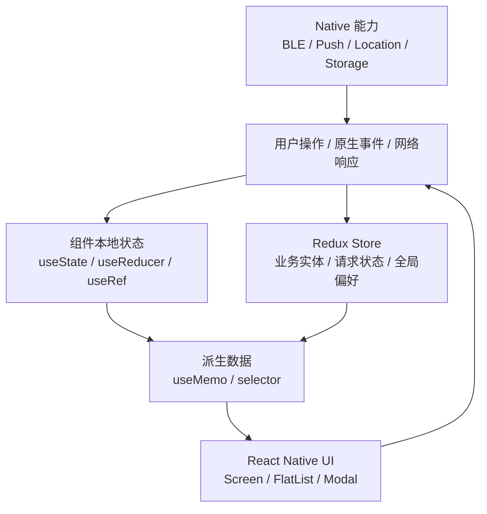
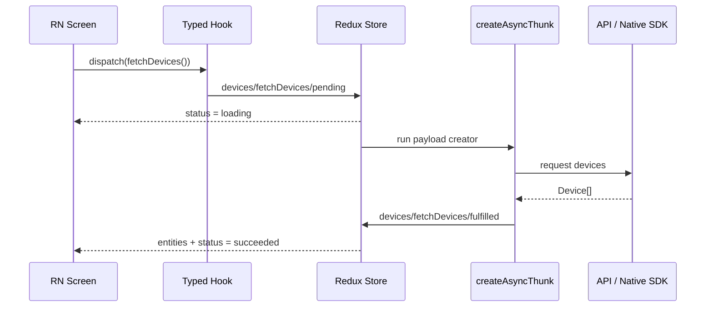

在 React Native 项目里，React、TypeScript 和 Redux 往往不是三块独立知识点。真正
的工程问题通常长这样：

- 页面上有异步请求、设备扫描、WebSocket、定位或原生事件订阅。
- UI 需要根据请求状态、权限状态、连接状态和用户操作即时变化。
- 列表很长，页面频繁切换，稍不注意就会重复监听、重复渲染或出现陈旧数据。
- 团队希望状态流可追踪、类型可约束、代码可维护，而不是靠约定和注释兜底。

所以这篇不把它写成 API 速查表，而是按 React Native 的状态边界来组织：哪些状态留
在组件内，哪些状态进入 Redux，TypeScript 如何描述业务状态，Hooks 和 selector 怎
么避免把性能问题放大。

## 先划清状态边界

React Native 应用里最容易失控的不是 Redux 本身，而是把所有状态都当成一种状态。比
较稳的划分方式是先问三个问题：

1. 这个状态是否只影响当前组件？
2. 这个状态是否需要跨页面共享或被多个业务流程消费？
3. 这个状态是否需要被追踪、回放、持久化或参与复杂异步生命周期？



一个实用原则是：**UI 临时态放本地，业务事实放 Redux，外部资源引用放 ref，派生视
图数据放 selector 或 useMemo**。

| 状态类型       | 推荐位置             | 例子                                           |
| -------------- | -------------------- | ---------------------------------------------- |
| 组件交互态     | `useState`           | 弹窗开关、输入框草稿、局部 loading             |
| 外部对象引用   | `useRef`             | 定时器、`FlatList` ref、BLE manager、WebSocket |
| 页面内复杂状态 | `useReducer`         | 多步骤表单、局部状态机                         |
| 跨页面业务状态 | Redux Toolkit        | 当前用户、设备列表、购物车、权限状态           |
| 派生数据       | selector / `useMemo` | 过滤后的列表、分组结果、统计值                 |

## Hooks：不是为了少写 class

Hooks 的价值不是把 class component 换一种写法，而是把组件生命周期、外部订阅和派
生计算拆成更小的同步单元。React Native 中要特别注意清理副作用，因为页面返回后仍
然收到原生事件，是很常见的内存泄漏和重复更新来源。

### useEffect：处理副作用，不是监听变量

`useEffect` 适合处理会触达 React 外部世界的逻辑，例如网络请求、事件订阅、定时
器、原生模块回调和手动操作外部实例。

```tsx
import { useEffect, useState } from "react";
import { DeviceEventEmitter } from "react-native";

type BluetoothState = "unknown" | "poweredOn" | "poweredOff";

export function useBluetoothState() {
  const [state, setState] = useState<BluetoothState>("unknown");

  useEffect(() => {
    const subscription = DeviceEventEmitter.addListener(
      "BluetoothStateChanged",
      (nextState: BluetoothState) => {
        setState(nextState);
      },
    );

    return () => {
      subscription.remove();
    };
  }, []);

  return state;
}
```

这里的重点不是“依赖数组为空”，而是这个 effect 建立了一条外部订阅，所以必须在组件
卸载时断开。依赖数组应该描述 effect 使用的响应式值，而不是作为“只执行一次”的万能
开关。

### useMemo：缓存派生结果

`useMemo` 适合缓存昂贵计算或保持派生数据引用稳定。它不应该被滥用在所有变量上，因
为缓存本身也有成本。

```ts
import { useMemo } from "react";

type Device = {
  id: string;
  name: string;
  connected: boolean;
  rssi: number;
};

export function useVisibleDevices(devices: Device[], keyword: string) {
  return useMemo(() => {
    const normalizedKeyword = keyword.trim().toLowerCase();

    return devices
      .filter((device) => device.connected)
      .filter((device) => device.name.toLowerCase().includes(normalizedKeyword))
      .sort((left, right) => right.rssi - left.rssi);
  }, [devices, keyword]);
}
```

在 RN 中，`useMemo` 的典型收益来自列表过滤、分组、排序、统计和其他会在每次
render重复执行的派生计算。

### useCallback：稳定函数引用

`useCallback` 缓存的是函数引用。它通常只有在函数会传给 `React.memo` 子组件、
`FlatList` 的 `renderItem`，或者作为 hook 依赖时才有明显价值。

```tsx
import { memo, useCallback } from "react";
import { FlatList, Pressable, Text } from "react-native";

type Device = {
  id: string;
  name: string;
};

type DeviceListProps = {
  devices: Device[];
  onSelect: (id: string) => void;
};

const DeviceRow = memo(function DeviceRow({
  device,
  onPress,
}: {
  device: Device;
  onPress: (id: string) => void;
}) {
  return (
    <Pressable onPress={() => onPress(device.id)}>
      <Text>{device.name}</Text>
    </Pressable>
  );
});

export function DeviceList({ devices, onSelect }: DeviceListProps) {
  const renderItem = useCallback(
    ({ item }: { item: Device }) => (
      <DeviceRow device={item} onPress={onSelect} />
    ),
    [onSelect],
  );

  return (
    <FlatList
      data={devices}
      keyExtractor={(item) => item.id}
      renderItem={renderItem}
    />
  );
}
```

如果子组件没有 memo，或者函数没有作为稳定依赖传下去，单独加 `useCallback` 往往只
是增加阅读成本。

### useRef：保存可变引用

`useRef` 适合保存不参与 UI 渲染的可变值。修改 `ref.current` 不会触发 render，所
以它常用于保存定时器、外部实例、上一次状态和防重复提交标记。

```ts
import { useEffect, useRef } from "react";

export function usePollingScan(scanDevices: () => void) {
  const timerRef = useRef<ReturnType<typeof setInterval> | null>(null);

  useEffect(() => {
    timerRef.current = setInterval(scanDevices, 3000);

    return () => {
      if (timerRef.current) {
        clearInterval(timerRef.current);
        timerRef.current = null;
      }
    };
  }, [scanDevices]);
}
```

这里不要使用 `NodeJS.Timeout` 作为默认答案。React Native 代码通常会同时面对浏览
器类型、Node 类型和原生运行环境，`ReturnType<typeof setInterval>` 更稳。

## Redux Toolkit：把业务状态变成可追踪数据流

Redux Toolkit 是现在写 Redux 的默认方式。它解决的不是“少写几行 action type”，而
是把 slice、action creator、不可变更新、异步生命周期和类型推导收到一套一致的写法
里。



### Store 和 typed hooks

先把 store 的类型导出来，再封装应用内统一使用的 `useAppDispatch` 和
`useAppSelector`。这样组件里不用反复手写 `RootState` 和 `AppDispatch`。

```ts
import { configureStore } from "@reduxjs/toolkit";
import { useDispatch, useSelector } from "react-redux";
import type { TypedUseSelectorHook } from "react-redux";

import devicesReducer from "./devicesSlice";

export const store = configureStore({
  reducer: {
    devices: devicesReducer,
  },
});

export type RootState = ReturnType<typeof store.getState>;
export type AppDispatch = typeof store.dispatch;

export const useAppDispatch = useDispatch.withTypes<AppDispatch>();
export const useAppSelector: TypedUseSelectorHook<RootState> = useSelector;
```

如果项目的 `react-redux` 版本还没有 `withTypes`，可以退回到下面这种写法：

```ts
export const useAppDispatch = () => useDispatch<AppDispatch>();
export const useAppSelector: TypedUseSelectorHook<RootState> = useSelector;
```

### 用类型表达业务状态

比起散落的 `isLoading`、`error`、`data`，业务状态更适合被建模成有限状态。这样 UI
分支会更清楚，也能减少“不该出现但类型允许”的组合。

```ts
type RequestStatus = "idle" | "loading" | "succeeded" | "failed";

type Device = {
  id: string;
  name: string;
  connected: boolean;
  rssi: number;
};

type DevicesState = {
  items: Device[];
  selectedId: string | null;
  status: RequestStatus;
  errorMessage: string | null;
};

const initialState: DevicesState = {
  items: [],
  selectedId: null,
  status: "idle",
  errorMessage: null,
};
```

在大型项目里，还可以进一步把请求状态写成 discriminated union，但对多数 RN 业务页
面来说，上面的结构已经足够直接。

### createSlice：可变写法，不可变结果

Redux Toolkit 内部使用 Immer，所以 reducer 里可以写“看似可变”的逻辑，最终仍然会
生成不可变更新。

```ts
import { createSlice, PayloadAction } from "@reduxjs/toolkit";

type Device = {
  id: string;
  name: string;
  connected: boolean;
  rssi: number;
};

type RequestStatus = "idle" | "loading" | "succeeded" | "failed";

type DevicesState = {
  items: Device[];
  selectedId: string | null;
  status: RequestStatus;
  errorMessage: string | null;
};

const initialState: DevicesState = {
  items: [],
  selectedId: null,
  status: "idle",
  errorMessage: null,
};

const devicesSlice = createSlice({
  name: "devices",
  initialState,
  reducers: {
    devicesReceived(state, action: PayloadAction<Device[]>) {
      state.items = action.payload;
      state.status = "succeeded";
      state.errorMessage = null;
    },
    deviceSelected(state, action: PayloadAction<string>) {
      state.selectedId = action.payload;
    },
    deviceConnectionChanged(
      state,
      action: PayloadAction<{ id: string; connected: boolean }>,
    ) {
      const device = state.items.find((item) => item.id === action.payload.id);

      if (device) {
        device.connected = action.payload.connected;
      }
    },
  },
});

export const { devicesReceived, deviceSelected, deviceConnectionChanged } =
  devicesSlice.actions;

export default devicesSlice.reducer;
```

这里 reducer 名字尽量描述业务事件，而不是描述 UI 操作。`deviceSelected` 比
`setSelectedId` 更接近“发生了什么”，后续看 Redux DevTools 或日志也更容易理解。

### createAsyncThunk：收拢异步生命周期

`createAsyncThunk` 会生成 `pending`、`fulfilled`、`rejected` 三类 action。它适合
处理 API 请求、异步存储读取、权限检查、原生 SDK 调用等可追踪流程。

```ts
import { createAsyncThunk, createSlice } from "@reduxjs/toolkit";

type Device = {
  id: string;
  name: string;
  connected: boolean;
  rssi: number;
};

type DeviceApi = {
  scanDevices: () => Promise<Device[]>;
};

export const fetchDevices = createAsyncThunk<
  Device[],
  void,
  { extra: { deviceApi: DeviceApi }; rejectValue: string }
>("devices/fetchDevices", async (_, { extra, rejectWithValue }) => {
  try {
    return await extra.deviceApi.scanDevices();
  } catch (error) {
    const message =
      error instanceof Error ? error.message : "扫描设备失败，请稍后重试";

    return rejectWithValue(message);
  }
});

const devicesSlice = createSlice({
  name: "devices",
  initialState,
  reducers: {},
  extraReducers: (builder) => {
    builder
      .addCase(fetchDevices.pending, (state) => {
        state.status = "loading";
        state.errorMessage = null;
      })
      .addCase(fetchDevices.fulfilled, (state, action) => {
        state.status = "succeeded";
        state.items = action.payload;
      })
      .addCase(fetchDevices.rejected, (state, action) => {
        state.status = "failed";
        state.errorMessage = action.payload ?? "未知错误";
      });
  },
});
```

`extra` 注入可以让 thunk 不直接 import 具体 SDK，测试时也更容易替换依赖。对于 RN
项目，这一点很有价值，因为原生模块、权限模块和设备 SDK 往往不适合直接跑在普通单
元测试环境里。

## Selector：Redux 性能的关键边界

很多 Redux 性能问题并不是 store 太慢，而是 selector 让组件订阅了过大的状态，或者
每次都返回新引用。

```ts
// 不推荐：每次 selector 都返回一个新对象，会触发额外渲染。
const deviceViewModel = useAppSelector((state) => ({
  items: state.devices.items.filter((device) => device.connected),
  selectedId: state.devices.selectedId,
}));
```

更稳的做法是拆分 selector，或者使用 memoized selector。

```ts
import { createSelector } from "@reduxjs/toolkit";

const selectDevicesState = (state: RootState) => state.devices;

export const selectAllDevices = createSelector(
  selectDevicesState,
  (devicesState) => devicesState.items,
);

export const selectConnectedDevices = createSelector(
  selectAllDevices,
  (items) => items.filter((device) => device.connected),
);

export const selectSelectedDeviceId = createSelector(
  selectDevicesState,
  (devicesState) => devicesState.selectedId,
);
```

组件里只订阅自己真正需要的部分：

```tsx
export function ConnectedDevicesScreen() {
  const dispatch = useAppDispatch();
  const devices = useAppSelector(selectConnectedDevices);
  const selectedId = useAppSelector(selectSelectedDeviceId);

  const handlePress = useCallback(
    (id: string) => {
      dispatch(deviceSelected(id));
    },
    [dispatch],
  );

  return (
    <DeviceList
      devices={devices}
      selectedId={selectedId}
      onSelect={handlePress}
    />
  );
}
```

当列表很长时，列表项不要直接订阅整块全局 state。让上层把必要数据整理好，再通过稳
定 props 传给 memoized row，通常更容易控制渲染范围。

## TypeScript：让状态边界可被编译器检查

TypeScript 在 RN 项目中的价值不只是补全。更重要的是它能把业务状态、Native 返回值
和组件 props 的边界固定下来。

### type 和 interface 怎么选

`interface` 更适合描述公开对象结构，特别是组件 props、SDK 返回对象和可扩展模型。
`type` 更适合联合类型、工具类型、函数类型和复杂组合。

```ts
interface DeviceRowProps {
  id: string;
  name: string;
  connected: boolean;
  onPress: (id: string) => void;
}

type ScanStatus = "idle" | "scanning" | "ready" | "error";

type DevicePatch = Partial<Pick<DeviceRowProps, "name" | "connected">>;
```

这不是硬性规则。团队更应该追求一致性，而不是在每个文件里争论 `type` 和
`interface`。

### 泛型适合抽象重复数据形状

RN 页面经常有相似的请求状态，可以用泛型抽象数据容器，而不是为每个页面重复写
`loading`、`data`、`error`。

```ts
type AsyncResult<T> =
  | { status: "idle" }
  | { status: "loading" }
  | { status: "success"; data: T }
  | { status: "error"; message: string };

function hasData<T>(
  result: AsyncResult<T>,
): result is { status: "success"; data: T } {
  return result.status === "success";
}
```

这种写法的好处是 UI 分支天然被状态收窄：

```tsx
if (result.status === "loading") {
  return <LoadingView />;
}

if (result.status === "error") {
  return <ErrorView message={result.message} />;
}

if (hasData(result)) {
  return <DeviceList devices={result.data} onSelect={handleSelect} />;
}
```

### keyof 和工具类型适合写安全的更新函数

当你需要限制可更新字段时，不要用裸字符串。

```ts
type Device = {
  id: string;
  name: string;
  connected: boolean;
  rssi: number;
  lastSeenAt: number;
};

type EditableDeviceKey = keyof Pick<Device, "name" | "connected">;

function updateDeviceField<K extends EditableDeviceKey>(
  device: Device,
  key: K,
  value: Device[K],
): Device {
  return {
    ...device,
    [key]: value,
  };
}
```

常用工具类型可以按意图记，而不是按语法背：

| 工具类型        | 适合场景                      |
| --------------- | ----------------------------- |
| `Partial<T>`    | 局部更新 payload              |
| `Pick<T, K>`    | 从模型中取出 UI 需要的字段    |
| `Omit<T, K>`    | 创建表单值，排除只读字段      |
| `Record<K, T>`  | 用 id 或枚举值建立映射        |
| `ReturnType<T>` | 复用函数返回值类型            |
| `Awaited<T>`    | 取出 Promise resolve 后的类型 |

## 常见性能问题和修正方向

### 问题一：把所有状态都塞进 Redux

Redux 应该保存业务事实，而不是所有 UI 细节。输入框草稿、局部展开状态、临时动画状
态、一次性弹窗开关通常留在组件内更合适。

### 问题二：selector 返回新对象

如果 `useSelector` 每次都返回 `{}`、`[]` 或 `filter()` 的新结果，即使数据内容没
变也可能触发渲染。拆分 selector 或使用 `createSelector` 是最常见的修正方式。

### 问题三：action 影响范围过大

一个 action 如果改动了很大的 state 分支，订阅这个分支的组件都会重新计算。设计
slice 时要按业务实体和页面读取方式拆分，而不是简单按接口返回值塞一整棵树。

### 问题四：列表项持有太多上下文

`FlatList` 的 row 组件应尽量接收稳定、扁平、必要的 props。不要让每个 row 都自己
去读一大块 Redux state，也不要在 `renderItem` 中创建大量 inline 对象。

```tsx
const keyExtractor = (item: Device) => item.id;

const DeviceRow = memo(function DeviceRow({
  device,
  selected,
  onSelect,
}: {
  device: Device;
  selected: boolean;
  onSelect: (id: string) => void;
}) {
  return (
    <Pressable onPress={() => onSelect(device.id)}>
      <Text>
        {selected ? "✓ " : ""}
        {device.name}
      </Text>
    </Pressable>
  );
});
```

### 问题五：effect 里混入业务状态同步

如果 effect 的职责变成“看到 A 变化就设置 B，再触发 C”，组件很快会变成隐式状态
机。这类逻辑要么收敛进 reducer，要么用明确的事件驱动，而不是靠多个 effect 互相触
发。

## Redux 和 Zustand 怎么选

Redux Toolkit 更适合大型团队、复杂数据流、强调 action 可追踪和调试链路的项目。
Zustand 更轻量，样板代码更少，适合中小型局部状态或不需要严格 action 语义的场景。

在 React Native 项目中，我通常会这样判断：

| 场景                                         | 更倾向                         |
| -------------------------------------------- | ------------------------------ |
| 多团队协作、业务流程复杂、需要 DevTools 追踪 | Redux Toolkit                  |
| 状态主要服务单个功能模块，逻辑轻，生命周期短 | Zustand                        |
| 服务端缓存、分页、重试、失效刷新             | TanStack Query / RTK Query     |
| 表单内部状态                                 | React Hook Form / 本地 reducer |
| 动画和手势状态                               | Reanimated shared value        |

真正需要避免的是“一个项目里所有状态都用同一种工具”。状态管理工具应该服务边界，而
不是替代边界设计。

## 结论

React Native 中写好 React、TypeScript 和 Redux，关键不是记住每个 API，而是把状态
边界设计清楚：

- 本地 UI 状态留在组件内。
- 外部订阅和资源引用必须清理。
- 跨页面业务事实进入 Redux，并通过 typed hooks 和 selector 暴露。
- TypeScript 用来表达业务状态，而不是只给变量补类型。
- 性能优化优先看订阅范围、引用稳定性和列表渲染边界。

当这些边界清楚以后，Redux 不会变成“全局变量仓库”，Hooks 也不会变成生命周期魔法。
代码会更容易调试、更容易测试，也更适合 React Native 这种同时面对 JS、Native 和多
线程渲染链路的工程环境。
