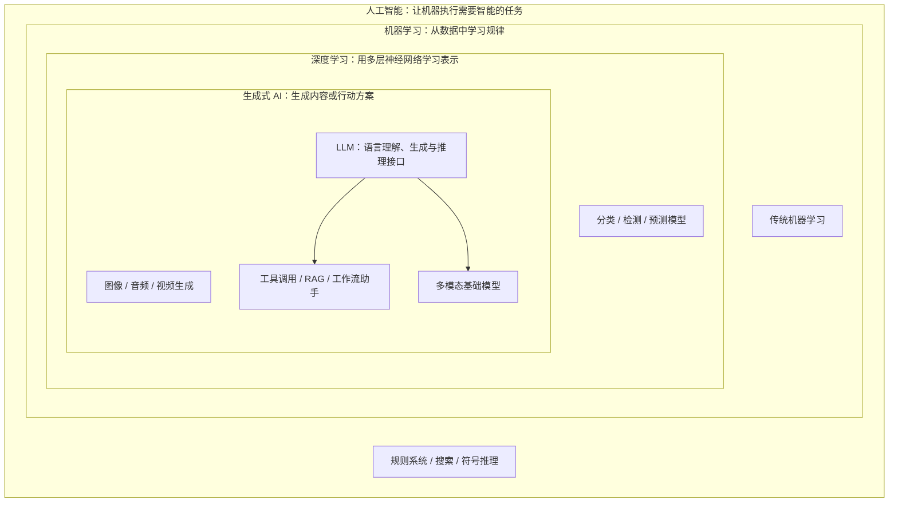
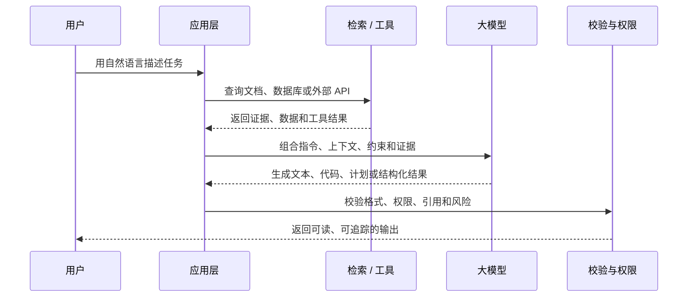
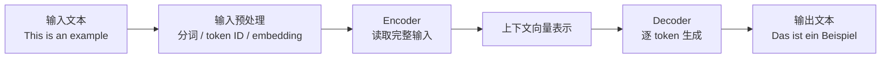
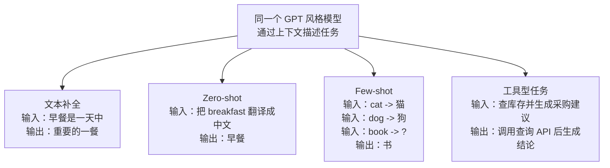
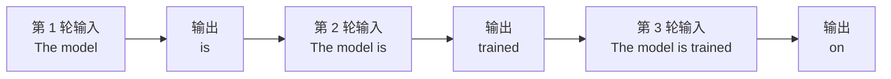
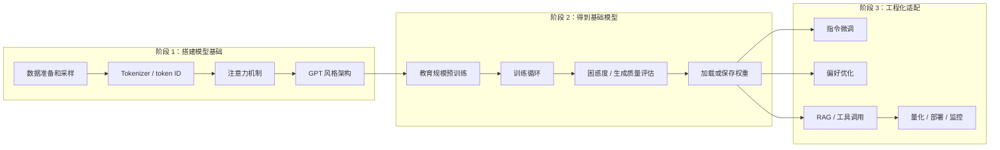

这篇笔记对应 Sebastian Raschka 的 _Build a Large Language Model (From Scratch)_
第 1 章。第一章不推公式，主要交代几件事：LLM 是什么，Transformer 为什么重要，BERT
和 GPT 的差异在哪里，预训练和微调分别做什么，以及后续章节如何从零实现一个小型 GPT
风格模型。

下面按原书顺序整理，并把容易过时的说法更新到 2026 年。GPT-3 时代可以把核心逻辑概
括成一句话：用 Decoder-only Transformer 在大规模语料上做 next-token prediction。
这个判断仍然成立，但已经不够。今天的大模型系统还包括长上下文、多模态输入输出、工
具调用、检索增强、偏好对齐、推理时计算和部署治理。

本文关注五个问题：

- LLM 在 AI、机器学习、深度学习、生成式 AI 里的位置。
- Transformer、BERT、GPT 风格架构之间到底是什么关系。
- 预训练、继续预训练、指令微调、偏好对齐和 RAG 分别解决什么问题。
- 为什么模型能力不能再只看参数量和训练 token 数。
- 如果要亲手构建一个小型 LLM，应该按什么顺序拆解输入、模型、训练和评估。

## LLM 定义

大语言模型最初指处理和生成自然语言文本的深度神经网络。这里的“大”，在 GPT-3 时代
主要体现在参数规模和训练语料规模；现在还要同时看上下文窗口、数据质量、多模态能
力、后训练质量、推理时策略和工具生态。

可以这样定义：LLM 是以语言为核心接口的基础模型。今天的前沿系统往往已经不是纯文本
模型，而是把文本、代码、图像、音频、视频、结构化数据和工具调用组织在一起的多模态
基础模型或智能体系统。LLM 仍然是其中的语言层，但不等同于整个 AI 系统。

它和传统 NLP 最大的差别，不只是模型更大，而是任务边界变了。早期 NLP 系统通常为
单一任务设计，例如垃圾邮件分类、情感分析、机器翻译。LLM 则更像一个通用语言接口：
同一个模型可以补全文本、总结文档、翻译、改写、回答问题、写代码，甚至在提示词中只
看少量示例就完成新任务。

这里的“理解”只取工程含义。模型能够处理上下文并生成连贯、相关的文本，但没有人的意
识或语义体验。更准确地说，LLM 学到了大量语言模式、事实关联、任务格式和上下文依
赖，因此表现出类似理解的行为。



这张图主要排除两个误解：

- LLM 不是 AI 的全部，它是深度学习在语言和通用任务接口上的重要分支。
- 生成式 AI 也不只有 LLM，图像、音频、视频生成和多模态理解同样属于生成式 AI。

## 传统 NLP 的边界

传统机器学习方法通常需要人工设计特征。以垃圾邮件分类为例，我们可能会手工统计某些
触发词出现频率、感叹号数量、大写词比例、可疑链接数量，然后把这些特征喂给分类器。
这种方法在边界清晰、任务单一的场景里很有效，但它很难扩展到开放式语言任务。

LLM 的突破点在于：模型不再依赖人工预先枚举语言特征，而是在大规模文本、代码和多模
态数据上自动学习表示。它学习的不是某几个词是否出现，而是词、短语、句子、上下文、
任务格式、代码结构、工具返回结果之间的高维关系。

LLM 的优势主要体现在这些任务上：

- 指令解析：从自然语言中理解用户要做什么。
- 上下文分析：结合前文、问题、约束和外部资料生成回答。
- 开放式生成：写邮件、写文章、写代码、生成结构化内容。
- 知识检索和压缩：从长文档、网页、代码库或数据库结果中提取要点。
- 工具编排：把自然语言请求拆成搜索、调用 API、执行代码、读取文件等步骤。

工程上，LLM 把很多原本需要定制 pipeline 的任务，压缩成了“输入上下文、调用模型、
校验输出”的统一接口。但模型不该接管所有逻辑。可靠系统仍然需要检索、权限、审计、
结构化约束、测试集和回退策略。

## 应用

只要任务可以写成“理解上下文、生成文本、选择下一步动作”，LLM 就可能参与。按工程形
态看，常见应用包括五类。

**内容生成类**

- 文案、邮件、小说、报告、会议纪要。
- 代码生成、代码解释、测试样例生成。
- 多语言翻译、改写、润色和风格迁移。

**文本理解类**

- 情感分析、主题分类、意图识别。
- 长文总结、信息抽取、实体识别。
- 法律、医疗、金融等专业文档问答。

**检索增强类**

- 基于企业知识库的问答。
- 基于代码库、日志、工单或文档的分析。
- 用引用、证据片段和版本信息约束回答边界。

**工具和智能体类**

- Function calling、API 编排、数据库查询。
- 面向内部系统的自然语言操作入口。
- 多步任务执行，例如规划、搜索、写入、校验和汇报。

**多模态类**

- 图片、PDF、表格、截图、音频和视频理解。
- 视觉问答、文档解析、语音交互。
- 文本与图像、代码、UI、数据结果之间的互相转换。



落地时先判断角色：模型是独立生成器、辅助决策器、检索后的回答器、工具编排器，还是
一个文本解析组件。

## 训练流程

GPT-3 时代常把训练流程简化成两个阶段：**预训练**和**微调**。这个二分法仍然有用，但
不够细。现在更常见的流程是：先预训练基座模型，再通过继续预训练、指令微调、偏好优
化、安全对齐、工具使用数据和评估反馈，把基座模型改造成助手或垂直模型。

```mermaid title="图 3：LLM 的训练与适配流程。"
flowchart LR
    subgraph Raw["大规模原始数据"]
        Web["网页 / 书籍 / 论文"]
        Code["代码"]
        Multi["图像 / 音频 / 视频 / 文档"]
    end

    Clean["数据清洗\n去重 / 过滤 / 配比"]
    Pretrain["预训练\nnext-token / 多模态目标"]
    Base["基座模型\n补全 / 少样本 / 通用表示"]
    Continue["继续预训练\n领域语料 / 新知识"]
    SFT["指令微调\n问答 / 代码 / 格式遵循"]
    Pref["偏好优化\nRLHF / RLAIF / DPO"]
    Tool["工具与 RAG 适配\n函数调用 / 检索 / 引用"]
    Eval["评测与安全治理\n离线集 / 红队 / 线上监控"]
    Product["可用模型或应用\n助手 / API / 私有部署"]

    Raw --> Clean --> Pretrain --> Base
    Base --> Continue --> SFT --> Pref --> Tool --> Eval --> Product
```



### 预训练：用大规模数据学通用能力

预训练阶段主要使用未标注或弱标注数据。这里的未标注不是说数据完全没有处理，而是说
它不需要人工为每个样本标出分类或答案。文本模型常通过自监督学习构造训练目标：给定
前面的文本，预测下一个 token。多模态模型还会加入图文对齐、视觉编码、音频或视频相
关目标。

这个任务看似简单，但它迫使模型学习很多隐含结构：

- 语法：什么词可以跟在什么词后面。
- 语义：哪些词和概念经常一起出现。
- 上下文：同一个词在不同语境下应该如何解释。
- 世界知识：大规模数据中反复出现的事实、关系和模式。
- 任务格式：问答、翻译、列表、代码、推理步骤、工具返回等文本模式。

预训练完成后得到的模型通常称为基础模型或基座模型。基础模型可以做文本补全，也可能
具备 zero-shot 和 few-shot 能力，但它未必适合直接作为聊天助手使用。

### 后训练：把基座模型塑造成可用系统

今天更常用“后训练”来描述基座模型之后的工作。它至少包括几类方法：

1. **继续预训练**：用领域语料继续训练，改善模型对某个行业、语言、代码库或内部知
   识的熟悉度。
2. **指令微调**：用指令-回答数据训练模型遵循自然语言指令。聊天助手、代码助手、
   文档问答助手通常依赖这一路线。
3. **偏好优化**：通过人类反馈、AI 反馈或成对偏好数据，让模型更符合有用性、诚实
   性、安全性和风格要求。RLHF 是经典方法，DPO 等直接偏好优化方法也很常见。
4. **工具与 RAG 适配**：让模型学会在需要时调用函数、检索知识库、引用证据、拒绝
   越权请求，而不是凭记忆直接回答。
5. **评测与安全治理**：用离线测试集、红队样例、线上监控和回归评测约束模型更新。

定制 LLM 通常做的是这部分工作。通用模型覆盖面广；特定领域里，继续预训练、指令数
据、RAG 和评测集通常比“只换提示词”更稳定。企业内部场景还要看三件事：敏感数据能
不能离开内网，模型是否需要端侧部署，推理成本能不能接受。

## Transformer

多数 LLM 仍建立在 Transformer 或 Transformer 变体上。Transformer 来自 2017 年的
论文 Attention Is All You Need，最初用于机器翻译。

原始 Transformer 由两部分组成：

- **Encoder**：读取完整输入，把文本编码成一组带上下文信息的向量表示。
- **Decoder**：基于编码后的表示，逐步生成输出文本。



Transformer 的核心不是层数很多，而是 **self-attention**。自注意力机制允许模型在
处理一个 token 时，动态关注序列中的其它 token。这样模型就能捕捉长距离依赖，例如
代词指代、跨句关系、前文约束和局部语义。

但 Transformer 不是单一形态。常见变体包括：

- Decoder-only 稠密模型：每个 token 都经过同一组参数，GPT 风格模型属于这一路线。
- MoE 模型：每个 token 只激活部分专家参数，用稀疏计算扩大总参数规模。
- 长上下文模型：通过位置编码、注意力优化、缓存和训练策略支持 100K 到百万级上下
  文。
- 多模态模型：把视觉、音频、文档或视频编码器接到语言模型上，再用统一接口生成回
  答。

Transformer 相比很多旧序列模型更适合大规模语言建模：它能把上下文关系编码进表示，
也更容易在现代硬件上并行训练。模型之间的差异更多来自数据、训练目标、后训练、上下
文扩展和推理部署。

## BERT 与 GPT

BERT 和 GPT 是理解 Transformer 分化的两个入口：模块不同，训练目标不同，能力倾向也
不同。

| 模型路线  | 主要使用的模块 | 训练目标       | 更擅长的任务                     |
| --------- | -------------- | -------------- | -------------------------------- |
| BERT 风格 | Encoder-only   | 预测被遮蔽的词 | 分类、理解、检索、语义匹配       |
| GPT 风格  | Decoder-only   | 预测下一个词   | 生成、补全、对话、代码和指令跟随 |

```mermaid title="图 5：BERT 和 GPT 对 Transformer 的不同使用方式。BERT 更像补空题，GPT 更像续写题。"
flowchart LR
    subgraph BERT["BERT 风格：Encoder-only"]
        direction LR
        BIn["输入\nThis is an [MASK]"]
        BEnc["Encoder\n双向读取上下文"]
        BOut["输出\nexample"]
        BIn --> BEnc --> BOut
    end

    subgraph GPT["GPT 风格：Decoder-only"]
        direction LR
        GIn["输入\nThis is an"]
        GDec["Decoder\n只看当前位置之前的 token"]
        GOut["输出\nexample"]
        GIn --> GDec --> GOut
    end

    BERT ~~~ GPT
```

BERT 接收带有遮蔽词的句子，并学习补全缺失位置。它的优势在于双向理解，所以仍常用
于文本分类、语义匹配、embedding、reranking 和检索系统。

GPT 则使用 Decoder-only 架构，从左到右逐 token 生成文本。它的训练目标非常统一：
给定已经出现的 token，预测下一个 token。正是这个简单目标，在足够大的模型和数据
下，形成了可泛化到翻译、摘要、分类、问答、代码和工具规划等任务的能力。

补充两点：

- Encoder-Decoder 路线没有消失，它仍适合翻译、摘要和一些结构化转换任务。
- 产品级助手通常不是单一架构解释完的系统，而是 GPT 风格语言模型、多模态编码器、
  RAG、工具调用、后训练和安全策略的组合。



## 数据与规模

LLM 的能力不只来自架构，也来自训练数据的规模、多样性和质量。GPT-3 是一个重要历史
坐标：它用 175B 参数和约 300B 训练 token 展示了大规模语言模型的 few-shot 能力。
如果今天仍只用 GPT-3 的数据表理解大模型，会漏掉四个现实：

1. 公开模型的训练语料已经从数千亿 token 扩展到十万亿 token 量级。
2. 很多闭源前沿模型不公开参数量、训练 token 数和完整数据配比。
3. 能力差异越来越来自数据治理、后训练、长上下文、多模态、工具使用和推理时计算。
4. 2026 年的产品形态已经把模型、工具、记忆、检索、代码执行和多模态输入组合成一个
   系统，单个模型名不再等于完整能力边界。

下面列几个公开信息相对充分的模型和产品形态，只作参照，不做排名。时间点为
2026-05-24。

| 模型或路线                   | 时间      | 公开规模信息或产品能力                                                   | 代表意义                                   |
| ---------------------------- | --------- | ------------------------------------------------------------------------ | ------------------------------------------ |
| GPT-3                        | 2020      | 175B 参数，约 300B 训练 token                                            | 让 few-shot prompting 成为主流讨论对象     |
| InstructGPT / RLHF           | 2022      | 基于人类反馈训练指令跟随模型                                             | 证明“会补全”不等于“好助手”，后训练很关键   |
| GPT-4                        | 2023      | 训练细节未完整公开，支持图文能力                                         | 闭源前沿模型开始强调多模态和系统级能力     |
| Llama 3.1 405B               | 2024      | 405B 参数，超过 15T token，128K 上下文                                   | 开放权重模型进入接近前沿的规模和上下文范围 |
| DeepSeek-V3                  | 2024/2025 | MoE，总 671B 参数，每 token 激活 37B                                     | 稀疏专家模型展示更高效的规模扩展路径       |
| Llama 4 Scout / Maverick     | 2025      | 原生多模态、开放权重、MoE；Scout 为 17B active / 16 experts、10M context | 多模态、开放权重、MoE 和超长上下文开始合流 |
| GPT-4.1 等长上下文模型       | 2025      | 官方支持最高 1M token 上下文                                             | 长上下文开始成为主流 API 能力              |
| Gemini 长上下文模型族        | 2026      | Google 文档列出多个 1M+ token 上下文模型                                 | 长上下文与多模态输入进入常规开发工作流     |
| Claude Opus 4.7 / Sonnet 4.6 | 2026      | Anthropic 文档列出 1M token 上下文和 128K/64K 输出                       | 模型文档开始明确上下文、输出和知识截止边界 |
| ChatGPT GPT-5.5              | 2026      | Instant / Thinking / Pro 路由，支持搜索、数据分析、图像和文件分析等工具  | 产品能力由模型、路由和工具共同决定         |

参数量、训练 token 数、上下文长度、激活参数、数据质量和后训练方法，都只解释能力的
一部分。工程选型还要看延迟、成本、稳定性、可观测性、版权、数据安全，以及模型能不
能稳定使用工具和外部状态。

### 2026 年的四个变化

**第一，长上下文已经常态化，但不是 RAG 的替代品。**

百万级上下文让“把整份代码库、长文档、视频转写或大量案例直接塞进上下文”变得可行。
但长上下文仍然有成本、延迟和多点检索准确率问题。对于需要持续更新、权限过滤、引用
追踪和低成本复用的系统，RAG、上下文缓存和结构化索引仍然重要。

**第二，模型能力越来越产品化。**

同一个“模型家族”在 API、ChatGPT、企业版、移动端或云厂商托管环境里的上下文长度、
工具支持、输出上限和速率限制都可能不同。以 ChatGPT GPT-5.5 为例，公开帮助文档把
它拆成 Instant、Thinking 和 Pro，并且上下文窗口会随套餐和模式变化。因此，写工程
文档时不要只写“某模型支持多少上下文”，而要写清楚入口、版本、套餐和调用方式。

**第三，知识截止日期要从能力描述里拆出来。**

有些模型文档会区分 reliable knowledge cutoff 和 training data cutoff。前者更像
“模型在哪个时间点之前的知识最可靠”，后者是训练数据覆盖范围。上线问答系统时，不应
把模型内置知识当作事实源；需要实时性的问题应接搜索、数据库、业务 API 或可审计的
知识库。

**第四，Agent 能力依赖系统工程，不只是模型聪明。**

2026 年的模型普遍强调 coding、tool use、computer use、deep research 和 agentic
workflow。但可靠的 Agent 还需要权限模型、可回放日志、工具 schema、失败重试、
人工确认、评测集和成本控制。模型负责规划和生成，系统负责边界和责任。

所以，多数团队不会从零训练大型基座模型。更常见的做法是：理解模型结构，使用开放权
重或商业 API，再针对业务数据做 RAG、继续预训练、指令微调、偏好优化、蒸馏、量化、
评测和提示词工程。

## GPT 架构

GPT 最初来自 OpenAI 的 Generative Pre-Training 路线，GPT-3 是它的大规模扩展版本。
早期 ChatGPT 可以理解为：在 GPT-3.5 系列基础上，用指令数据和人类反馈相关方法继续
训练出的对话模型。今天的前沿助手不是“一个 GPT 模型在聊天”，还包括后训练、多模
态输入、工具调用、安全策略、记忆或上下文管理、推理时策略。

GPT 架构仍然要重点看，因为它解释了生成式助手的基本生成逻辑。

**第一，Decoder-only。**

GPT 不再使用原始 Transformer 的 Encoder-Decoder 组合，而主要使用 Decoder 部分。
这让它天然适合做从左到右的文本生成。

**第二，自回归生成。**

自回归模型会把前面已经生成的输出继续作为下一步输入。生成流程可以理解为：

```mermaid title="图 7：GPT 预训练中的 next-token prediction。训练样本来自文本本身，目标是根据前文预测下一个 token。"
flowchart LR
    TrainText["训练文本\nThe model is trained on data"]
    X["输入序列\nThe model is trained on"]
    Y["训练标签\ndata"]
    Loss["损失函数\n预测 token 越接近标签，损失越小"]

    TrainText --> X
    TrainText --> Y
    X --> Loss
    Y --> Loss
```

生成时，每一步都只预测一个下一个 token，但重复执行后就得到完整文本。



**第三，能力来自预训练、后训练和系统编排的叠加。**

GPT 主要用预测下一个 token 训练，并没有专门为每个任务单独训练架构。但当模型、数
据和训练规模足够大时，它会表现出一些没有被显式指定的能力，例如翻译、摘要、分类、
格式转换、少样本学习和代码生成。后训练进一步把这种通用能力塑造成更符合人类指令的
行为，RAG 和工具调用则把模型能力连接到外部事实和真实系统。

这里要谨慎。涌现不是神秘智能，通常只是大规模训练后，一些能力在宏观评测中变得明显。
近年的研究还指出，部分“突然涌现”可能来自评测指标的非线性、阈值设定或统计方式，不
一定意味着模型内部发生了相变。工程上更应该把能力拆开看：预训练数据、提示格式、模
型规模、后训练数据、检索证据、工具结果和解码策略都会影响结果。

## 实现路线

学习原理时，可以从零实现一个小型 GPT 风格模型。这里的“从零”不是复现前沿模型，而
是把 tokenizer、embedding、attention、Transformer block、训练循环和评估串起来。
做业务时，通常优先考虑现成 API、开放权重、RAG、轻量微调和评测治理。



### 阶段 1：实现输入管线和基础结构

这一阶段不急着训练大模型，而是先解决模型能不能吃进文本：

- 文本如何被切成 token。
- token 如何变成 token ID。
- token ID 如何映射成向量。
- 如何用滑动窗口构造输入和目标。
- self-attention 如何根据上下文分配权重。
- 多层 Transformer block 如何组成 GPT 风格架构。

### 阶段 2：做教育规模的预训练

GPT-3 级别的预训练成本极高，更不用说当前前沿模型。学习时更现实的做法是用小数据、
小模型跑通完整训练流程：

- 前向传播如何生成 logits。
- 损失函数如何衡量下一个 token 预测质量。
- 反向传播和优化器如何更新权重。
- 如何划分训练集和验证集。
- 如何保存、加载和评估模型权重。

这个阶段不是为了训练出强模型，而是为了看清训练循环里每个组件的作用。

### 阶段 3：加载权重并做工程化适配

理解架构后，可以加载已有开放权重，跳过昂贵的从零预训练，直接做业务适配：

- 指令微调：让模型学会按团队定义的格式回答、解释、总结和执行任务。
- 偏好优化：让输出更贴近团队对安全性、稳定性和风格的要求。
- RAG：把模型回答绑定到可检索、可引用、可更新的外部知识。
- 工具调用：让模型在权限边界内调用 API、数据库、搜索和代码执行环境。
- 评测治理：用固定测试集、线上样本和失败案例跟踪模型版本变化。

这条路线更接近实际工程。

## 问题

1. 我们当前业务里哪些任务本质上可以改写成输入上下文、输出目标文本或下一步动作？
2. 哪些任务适合直接调用通用模型，哪些任务需要 RAG、工具调用、领域微调或私有部署？
3. 如果不能把数据发给第三方模型，端侧小模型、本地部署和私有化 API 各自的成本边界
   是什么？
4. 对团队来说，最该从零实现的是 tokenizer、attention、训练循环，还是评测、RAG
   与后训练管线？
5. 哪些指标应该进入模型上线门槛：事实准确率、引用覆盖率、延迟、成本、安全拒答、
   格式合规，还是用户满意度？

## 结论

第一章的主线很清楚：LLM 属于深度学习和生成式 AI 的交叉区域，核心架构主要来自
Transformer；GPT 风格模型使用 Decoder-only 路线，通过自监督的
next-token prediction 获得通用生成能力，再通过继续预训练、指令微调、偏好优化、
RAG、工具调用和评测治理变成具体产品能力。

后续章节的 tokenizer、embedding、attention、Transformer block、训练循环和微调方
法，都属于这条链路。读这本书不是为了“自己造一个 ChatGPT”，而是为了理解模型能
力、训练阶段、数据策略和工程落地之间的关系。

## 参考

- Sebastian Raschka, _Build a Large Language Model (From Scratch)_, Chapter 1:
  Understanding large language models.
- Vaswani et al., [_Attention Is All You Need_](https://arxiv.org/abs/1706.03762), 2017.
- Radford et al., [_Improving Language Understanding by Generative
  Pre-Training_](https://cdn.openai.com/research-covers/language-unsupervised/language_understanding_paper.pdf), 2018.
- Brown et al., [_Language Models are Few-Shot Learners_](https://arxiv.org/abs/2005.14165), 2020.
- Ouyang et al., [_Training language models to follow instructions with human
  feedback_](https://arxiv.org/abs/2203.02155), 2022.
- OpenAI, [_GPT-4 Technical Report_](https://arxiv.org/abs/2303.08774), 2023.
- Meta AI, [_Introducing Llama 3.1: Our most capable models to
  date_](https://ai.meta.com/blog/meta-llama-3-1/), 2024.
- Meta AI, [_The Llama 3 Herd of Models_](https://arxiv.org/abs/2407.21783), 2024.
- Soldaini et al., [_Dolma: an Open Corpus of Three Trillion Tokens for
  Language Model Pretraining Research_](https://arxiv.org/abs/2402.00159), 2024.
- DeepSeek-AI, [_DeepSeek-V3 Technical Report_](https://arxiv.org/abs/2412.19437), 2024.
- Meta AI, [_The Llama 4 herd: The beginning of a new era of natively multimodal
  AI innovation_](https://ai.meta.com/blog/llama-4-multimodal-intelligence/), 2025.
- OpenAI, [_Introducing GPT-4.1 in the API_](https://openai.com/index/gpt-4-1/), 2025.
- Schaeffer, Miranda, and Koyejo, [_Are Emergent Abilities of Large Language
  Models a Mirage?_](https://arxiv.org/abs/2304.15004), 2023.
- Google AI for Developers, [_Long context_](https://ai.google.dev/gemini-api/docs/long-context), 2026.
- Anthropic, [_Claude models overview_](https://docs.anthropic.com/en/docs/about-claude/models/overview), 2026.
- OpenAI Help Center, [_GPT-5.5 in ChatGPT_](https://help.openai.com/en/articles/11909943-gpt-5-5-in-chatgpt), 2026.
