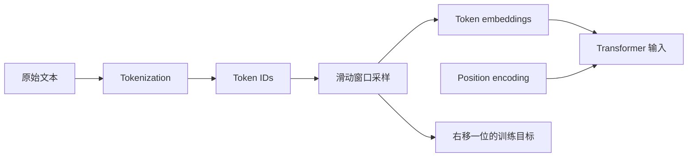
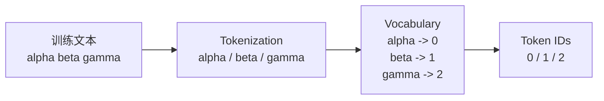
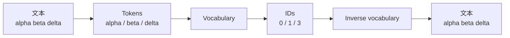
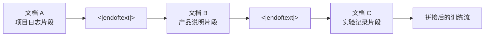
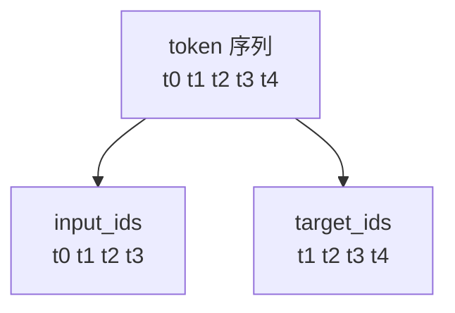
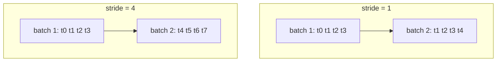
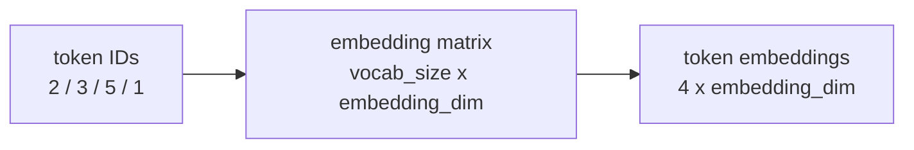
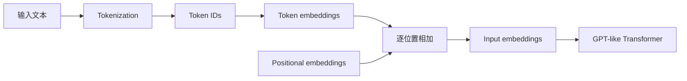

训练还没开始，文字已经被输入管线改写过一次。

LLM 并不是直接“读”中文、英文或代码。神经网络处理的是数值张量，不是原始字符串。
所以文本必须先被 tokenizer 切成 token，再被映射成 token ID；这些整数经过
embedding layer 查表，变成连续向量，最后再和位置信息相加，送进 GPT-like
Transformer。

这条入口流程常被归到“预处理”，但它不只是数据清洗。tokenizer、词表、特殊 token、采
样方式、embedding 和位置编码共同定义了一套离散序列协议。模型能看见哪些符号、以
多长的序列看见、在哪里知道文档结束、又用什么方式记住顺序，都在这个阶段被决定。

到 2026 年，这套协议已经不只服务于普通文本补全。工具调用、结构化输出、长上下文检
索、多模态输入和推理 token 都会挤进同一个 token 预算里。讨论“文本如何进入模型”
时，已经不能只看 tokenizer 和 embedding，还要看 API 层怎样包装消息、工具和约束。

## Embedding 先解决表示问题

理解 LLM 输入，第一步不是 tokenizer，而是表示问题。tokenizer 负责把文本离散化，
embedding 则负责把离散对象放进连续向量空间。没有这一步，神经网络里常见的矩阵乘
法、反向传播和梯度更新都无从谈起。

文本里的 embedding 也不止一种。Word2Vec 这类早期方法会根据上下文相似性学习词向
量；RAG 常用 sentence embedding 或 document embedding 做检索；GPT-like LLM 输
入层里的 token embedding 则是模型参数的一部分，会随着语言建模目标一起训练。它们
都叫 embedding，但训练目标、使用位置和向量含义并不相同。

## 文本输入分三层处理

文本输入可以分成三层。

- **符号层**：把字符串切成 token。token 可能是词、子词、标点、空白、字节片段，也可
  能是特殊控制符。
- **索引层**：把每个 token 映射到一个整数 ID。词表就是这张映射表。
- **向量层**：用 embedding layer 把 token ID 查成向量，再补上位置信息。

如果只把 tokenizer 看成“切词工具”，会漏掉很多实际影响。它规定了模型和文本世界之
间的接口：词表多大、怎样切分、是否保留空格和换行、怎样处理中文和代码、哪些符号被
当成特殊 token，都会改变模型看到的输入，也会改变训练和推理成本。

## Token 不等于单词

入门材料常用 “word prediction” 解释语言模型。这个说法方便理解，但真正训练时
更准确的说法是 **next-token prediction**。现代 LLM 预测的通常不是自然语言意义上的
“词”，而是 tokenizer 产出的 token。为了讲清滑动窗口，示意图里经常直接画文字；真
正进入模型的仍然是 token ID。

这会影响很多具体问题：

- 英文里，一个常见单词可能刚好是一个 token，也可能被切成几个子词。
- 中文、日文、韩文和代码混排文本里，token 边界往往和“词”没有简单对应关系。
- 空格、换行、缩进、标点、控制符，可能单独成 token，也可能被并到相邻 token 里。
- API 计费、上下文长度、KV cache、延迟和训练 FLOPs，看的都是 token 或由 token 决定
  的序列长度，不是自然语言里的词数。

简化 tokenizer 只适合解释机制。它的价值在于暴露“切分、建表、编码、解码”这几
步，而不是模拟真实模型的 tokenizer。是否丢弃空白也要看任务：普通文本可以
过滤多余空白，Python 代码、Markdown、表格或缩进敏感的文本却可能需要保留空白。

一个极简 tokenizer 的重点不在具体规则，而在于把三件事拆开：分隔文本、清理空白、
保留标点。真实 tokenizer 还会进一步处理子词、字节、特殊 token 和跨语言文本。

## 词表只是索引表

构造词表的最小做法很直接：先找出所有不重复的 token，排序，然后给每个 token 分配
一个整数 ID。这个过程能说明词表的角色：词表不是语言本身，它只是训练语料里可被模
型识别的一张索引表。

问题也很快出现了。如果新文本里有词表没见过的 token，最朴素的查表会直接失败。

一个最小 tokenizer 往往会先加入两个特殊 token：

- `"<|unk|>"`：表示词表外 token。
- `"<|endoftext|>"`：表示独立文档之间的边界。

加入这两个 token 后，tokenizer 开始承担“序列协议”的角色。模型除了文本内容，还要
处理文档边界、padding、用户问题、助手回答、工具调用，甚至系统级控制信息。有些模
型还会显式区分 `[BOS]`、`[EOS]` 和 `[PAD]`：序列开头、序列结尾和 padding 都可能
有自己的协议语义。

这一点在 2026 年更加明显。现代 API 不只是把一段纯文本交给模型，还会把 system、
user、assistant、tool 调用、工具结果、结构化输出约束和拒答信号组织成模型能理解的
消息协议。OpenAI 的 Structured Outputs 会在解码阶段根据 JSON Schema 转成上下文无
关文法（CFG），动态屏蔽不合法的下一个 token；GPT-5 系列的 custom tools 也支持用
正则或 CFG 约束工具输入。这意味着“序列协议”不只发生在训练前，也发生在推理时的采
样边界上。

现代 GPT 风格 tokenizer 通常不会靠 `"<|unk|>"` 来兜底未知词。BPE、WordPiece 或
SentencePiece 这类子词 tokenizer 会把没见过的词继续拆小，直到能用已有单元表示。
这解决了“词表外”问题，但也带来新的代价：低频语言、拼写错误、专有名词、URL、代码
片段常常会被切得很碎，于是同样一段信息会占用更多 token。

最小 tokenizer 的核心是两张方向相反的表：一张把 token 映射成 ID，用于 encode；另
一张把 ID 映射回 token，用于 decode。加入 `"<|unk|>"` 后，encode 阶段还要先处理词
表外 token。

## 不要再用 `gpt2` 估算现代模型

简化 tokenizer 让接口变得可见，但真实 GPT-like 模型通常会使用 BPE 这类子词
tokenizer。以 `tiktoken.get_encoding("gpt2")` 为例，GPT-2 encoding 的词表大小是
50,257，`"<|endoftext|>"` 的 token ID 是 50,256，也就是最后一个 ID。

但放到今天看，`gpt2` encoding 已经不能代表当前 OpenAI 模型的默认
tokenizer。按 `tiktoken` 当前的模型映射，`gpt-5`、`gpt-4o`、`gpt-4.1` 和 `gpt-4.5`
等模型族使用 `o200k_base`，GPT-4 和 GPT-3.5 系列则使用 `cl100k_base`。所以在估算
token 数量、裁剪上下文、设计缓存 key 或复现 API 行为时，不能再拿 `gpt2` 当万能近
似。

更重要的是，2026 年的模型 ID、上下文窗口和计费规则变化很快。截至 2026-05-26，
OpenAI 模型页已经列出 GPT-5.4、GPT-5.5 这类百万级上下文模型；同一个 GPT-5 家族
里，也可能同时存在 400K 和 1,050,000 token 的上下文窗口。工程上应该优先使用目标
provider 的 tokenizer 映射、token counting API 或模型参考页，而不是把某个 encoding
名字写死在业务逻辑里。

BPE 的基本优势并没有过时。OpenAI 的 `tiktoken` 文档仍然强调 BPE 的几个实用特点：
可逆、能处理任意文本、能把字节序列压缩成较短 token 序列，也会让模型更多看到常见子
词。它的直觉也很清楚：BPE 从字符开始，把高频字符组合逐步合并成子词和词；遇到没
见过的词时，就退回到更小的子词甚至字符，而不是直接变成 `"<|unk|>"`。BPE 不是什么
语义完美的切词器，它是一套足够快、足够稳定、足够可逆的序列化协议。

它的局限也很具体：

- **不同语言不一定公平**：同样信息量的中文、英文、代码、emoji，可能会被切成差异很
  大的 token 数。
- **边界不等于语义边界**：BPE 的合并主要由频率决定，不保证符合语言学意义上的“词”。
- **上下文窗口不是免费空间**：文本被切得越碎，注意力计算、KV cache 和延迟压力就越
  大。
- **tokenizer 版本会带来偏差**：如果训练、检索、评估和线上推理使用不同 tokenizer，
  长度估算和截断策略会出错。

## 用滑动窗口生成训练样本

有了 token ID，还要把长序列切成可训练的样本。最小做法是用 `max_length` 和
`stride` 把一段长 token 序列切成多个训练样本：输入是 `[t0, t1, t2, t3]`，目标则是
右移一位的 `[t1, t2, t3, t4]`。

这就是自回归语言模型最基本的训练样本。模型在每个位置预测下一个 token。上下文越
长，模型可利用的信息越多，但训练和推理成本也越高。

用 `context_size=4` 就能看清 `x` 和 `y` 只差一个位置。这个尺寸只是为了演示机制；
真实训练里，context size 至少会是几百到几千 token，今天的长上下文模型则远不止这
个量级。

`stride` 控制窗口每次向前移动多少。`stride=1` 会产生大量重叠样本，数据利用更密集，
但样本之间相关性也更强；`stride=max_length` 则没有重叠，更省，也能避免相邻 batch
重复过多。这个解释今天仍然成立。

实现时，数据集通常先把全文编码成 `token_ids`，再用滑动窗口切出 `input_ids` 和右移
一位的 `target_ids`。如果最后一个 batch 不足指定大小，训练管线通常会选择丢弃或补
齐，避免 batch 形状和 loss 波动带来额外麻烦。这个 dataloader 只是最小实现，真实预
训练管线还会在它上面加很多层：

- **文档打包**：把多个短文档塞进固定长度序列，减少 padding 浪费。
- **边界处理**：跨文档拼接时，用边界 token 和 loss mask 避免模型把无关文档误当成连
  续上下文。
- **对话模板**：对话模型会把 system、user、assistant、tool 等角色编码进固定格式，
  而不是简单拼接裸文本。
- **数据配比**：真实训练通常会混合网页、书籍、代码、数学、合成数据、对话数据和多
  语言数据，而不是只对一个文本文件滑窗。
- **去重与污染控制**：重复数据会影响泛化，评测集污染则会让模型看起来比实际更强。

延续到后面训练循环里的，是一批形状稳定的 `input_ids` 和 `target_ids`。

## Token embedding 是模型参数

`torch.nn.Embedding(vocab_size, output_dim)` 可以把 token embedding 解释得很干
净：它是一张可训练的查表矩阵。token ID 是行号，embedding vector 是那一行的参数。
训练刚开始时，这些向量通常随机初始化；之后它们会随着语言建模 loss 一起被更新。

从实现上看，embedding layer 可以理解成“更高效的一热编码 + 线性层”。如果真的把
token ID 先变成 one-hot 向量，再乘以一个矩阵，也能得到同样的查表结果；PyTorch 的
`Embedding` 只是直接按行取参数，少走了巨大的稀疏矩阵乘法。

一个常见混淆是：LLM 里的 token embedding，和 RAG 系统里常说的 sentence
embedding、document embedding，不是一回事。

- token embedding 是模型内部参数，服务于 next-token prediction。
- sentence/document embedding 通常来自另一个编码模型，服务于检索、聚类、相似度计
  算或重排。

它们都叫 embedding，但训练目标、使用位置和向量含义完全不同。把这两类东西混为一
谈，是做 LLM 应用时很常见的概念误区。

从模型成本看，embedding matrix 也不是小配件。词表越大，embedding 和输出投影相关
参数就越多；如果输入 embedding 和输出 LM head 不共享权重，参数量还会继续增加。真
实模型会在 tokenizer 粒度、词表大小、多语言覆盖、推理成本和训练稳定性之间折中。

从张量形状看，`vocab_size` 决定 embedding matrix 有多少行，`output_dim` 决定每个
token 的向量维度。一段长度为 4 的 token ID 序列，经过 embedding layer 后会变成
`4 x embedding_dim` 的向量序列。

## 位置编码处理顺序信息

还要处理一个顺序问题：同一个 token ID 总会查到同一个 token embedding。也就是说，
`fox` 出现在第 1 个位置还是第 4 个位置，单靠 token embedding 本身看不出来。自注意
力机制本身也不天然知道顺序，所以模型还需要额外的位置信息。

位置方法可以粗略分成两类：absolute positional embeddings 直接给每个绝对位置一条可
学习向量；relative positional embeddings 更关心 token 之间“相隔多远”。用 GPT 风格
的可训练 absolute positional embeddings 做代码示例，在 GPT-2/GPT-3 的语境里没有
问题，也很适合解释“为什么 token embedding 还需要位置信息”。但如果把它推广到今天
所有 GPT-like LLM，就不够准确了。

现代长上下文模型大量使用 RoPE 及其变体，也会采用其他相对位置或偏置机制。RoPE 的
直觉是把位置信息编码进 query/key 的旋转相位，而不是简单给 token embedding 加一个
按绝对位置查表得到的向量。到 2026 年，仍然有论文专门分析 RoPE 在长上下文下的基频
选择和位置相干性。对长上下文 Transformer 来说，这已经是模型设计里的工程问题。

位置编码之所以更值得重视，是因为上下文窗口已经从早期示例里的几百、几千 token，扩
展到 128K、400K、1M 甚至更长。截至 2026-05-26，Meta 的 Llama 3.1 模型卡列出
128K context length；OpenAI 的 GPT-5.1 模型页列出 400K context window；GPT-5.4
和 GPT-5.5 模型页则列出 1,050,000 context window。Anthropic 的 Claude 文档也把部
分 Claude 4.x 模型的上下文窗口标到 1M。这样的窗口规模会反过来要求 tokenizer、位置
编码、注意力实现、KV cache 和评估方法一起升级。

长上下文不等于无限记忆。实际系统里还要考虑：

- 输入、输出和推理过程中的中间 token 共享上下文预算。
- reasoning/thinking tokens 可能不可见，但仍会占用上下文窗口并计入输出 token 成本。
- 不同 provider 对 thinking block 的保留策略不同，工具调用链路里尤其不能只按可见文
  本估算。
- 长上下文检索并不是均匀可靠，仍需要专门测试 needle、multi-hop、MRCR 和
  lost-in-the-middle。
- KV cache 显存会随序列长度增长，部署成本很快成为瓶颈。
- 对许多任务，RAG、摘要压缩和结构化索引仍然比直接塞满上下文更可靠。

这一层的要点是：**token embedding 必须带上位置信息；absolute positional embedding
是理解 GPT-2/GPT-3 的好入口；而现代长上下文 LLM 更常讨论的是 RoPE、位置缩放、相
对位置偏置，以及推理时的 KV cache 约束。**

用可训练的 absolute positional embeddings 做示例时，关键约束是：位置向量的数量要
覆盖 `context_length`，向量维度要和 token embedding 一致。这样每个位置的 token
embedding 才能和对应的 positional embedding 相加，形成最终输入。

## 参考资料

- Sebastian Raschka, _Build a Large Language Model (From Scratch)_, Chapter 2,
  "Working with text data".
- OpenAI, [`tiktoken` README](https://github.com/openai/tiktoken/blob/main/README.md)
  与 [`tiktoken/model.py`](https://github.com/openai/tiktoken/blob/main/tiktoken/model.py)。
- OpenAI, [GPT-5.1 API model documentation](https://developers.openai.com/api/docs/models/gpt-5.1),
  [GPT-5.4 API model documentation](https://developers.openai.com/api/docs/models/gpt-5.4)
  和 [GPT-5.5 API model documentation](https://developers.openai.com/api/docs/models/gpt-5.5)。
- OpenAI, [Structured model outputs](https://developers.openai.com/api/docs/guides/structured-outputs)
  与 [Introducing Structured Outputs in the API](https://openai.com/index/introducing-structured-outputs-in-the-api/)。
- OpenAI, [Introducing GPT-5 for developers](https://openai.com/index/introducing-gpt-5-for-developers/)
  和 [Reasoning models](https://developers.openai.com/api/docs/guides/reasoning)。
- Anthropic, [Context windows](https://platform.claude.com/docs/en/build-with-claude/context-windows)。
- Meta, [Llama 3.1 model card](https://github.com/meta-llama/llama-models/blob/main/models/llama3_1/MODEL_CARD.md)。
- Seokjae Lee and A. Nicki Washington, [Rotary Positional Embeddings as Phase Modulation](https://arxiv.org/abs/2602.10959)。
